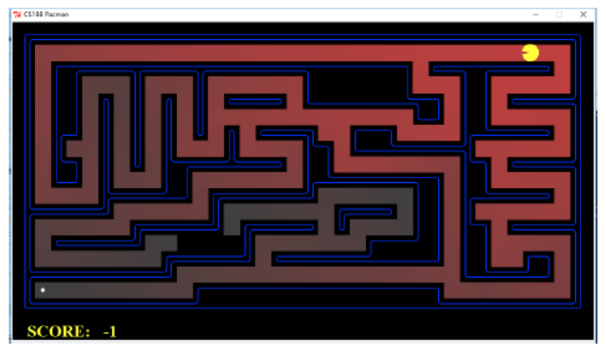
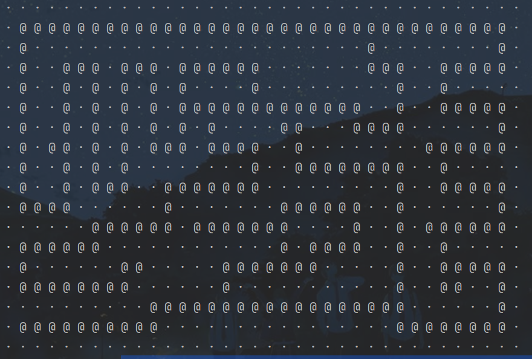
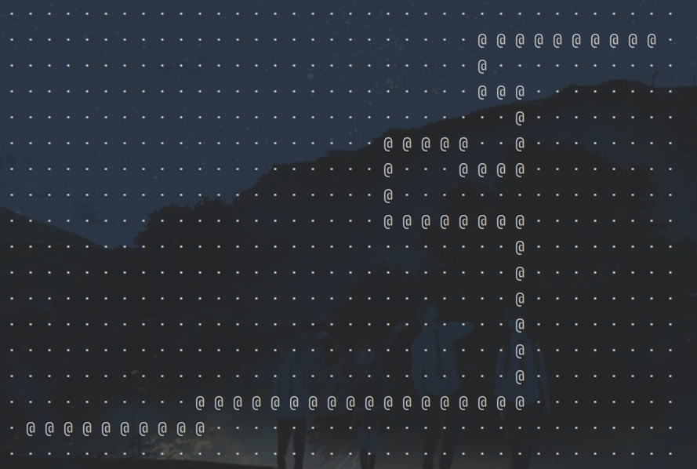
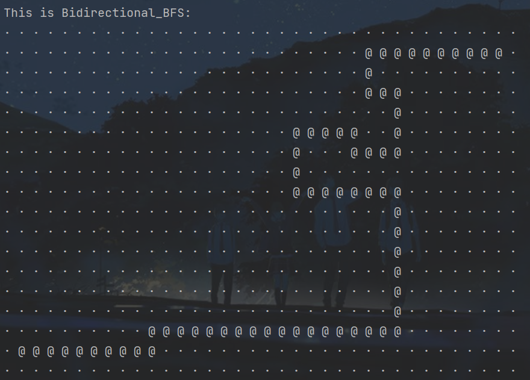
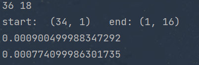

# 中山大学计算机学院

## 人工智能实验报告

课程名称：Artificial Intelligence

| 教学班级 | 超算班      | 专业  | 信息与计算科学 |
|:----:|:--------:|:---:|:-------:|
| 学号   | 21307261 | 姓名  | 王健阳     |

### 一，实验题目

    盲目搜索

### 二，实验内容

#### 算法原理

###### 1.单向BFS搜索

        将起点作为初始目标节点放入队列中，每次先取出队头元素作为目标节点，依次将目标节点的所有合法（不为墙且没有被访问过）邻接节点加入到队列当中，同时标记邻接节点的父节点为目标节点，方便后期输出路线。一直循环直至队列为空，或者遍历到终点时退出循环。

###### 2.双向BFS搜索

        在起点和终点同时进行BFS，步骤同上方一致。只有退出循环的条件改为，检测当前节点的邻接节点中是否存在在对方队列中的元素。如果存在，就分别记录下此时双方队列的终点节点，便于后期输出路线。

#### 伪代码

> Unidirectional_BFS

```
procedure Unidirectional_BFS(start, destination) begin
    var queue
    queue.push(start)
    while !queue.empty() begin
        var n = queue.length()
        for i in range(n) begin
            var temp = queue.front()
            queue.pop()
            if temp == destination begin
                break
            end
            for point in temp.neighbor begin
                point.par = temp
                queue.push(point)
            end
        end
    end
end
```

> Bidirectional_BFS

```
procedure Bidirectional_BFS(start, destination) begin
    var start_queue, destination_queue
    start_queue.push(start)
    destination_queue.push(destination)

    while !start_queue.empty() begin
        var n = start_queue.length()
        for i in range(n) begin
            var temp = start_queue.front()
            start_queue.pop()
            if (one of temp.neighbor) in destination_queue begin
                m1 = one of temp.neighbor
                m2 = temp
                break
            end
            for point in temp.neighbor begin
                point.par = temp
                queue.push(point)
            end
        end
    end


    while !destination_queue.empty() begin
        var n = destination_queue.length()
        for i in range(n) begin
            var temp = destination_queue.front()
            destination_queue.pop()
            if (one of temp.neighbor) in start_queue begin
                m1 = one of temp.neighbor
                m2 = temp
                break
            end
            for point in temp.neighbor begin
                point.par = temp
                queue.push(point)
            end
        end
    end
end
```

#### 关键代码展示

（因为这次只有一个文件，所以没写代码readme

> 主函数部分

```python
#  初始化函数，读取地图数据
def ReadData():
    global x_range, y_range
    file = open("MazeData.txt", 'r')
    content = file.read().split('\n')[:-1]
    file.close()

    x_range = len(content[0])
    y_range = len(content)
    print(x_range, y_range)
    for string in content:
        # print(' '.join(list(string)))
        pass
    return Maze(content)


# 输出函数，根据path列表将路径可视化
def Show(path: list):
    answer = []
    for ii in range(y_range):
        answer.append(['·'] * x_range)
    for point in path:
        answer[point.y][point.x] = '@'
    for ii in answer:
        print(' '.join(ii))
    print('----------------')


if __name__ == '__main__':
    # 根据输入数据初始化迷宫，并深拷贝至两份用于比较两种算法
    ubfs_maze = ReadData()
    bbfs_maze = copy.deepcopy(ubfs_maze)
    start = ubfs_maze.GetStart()
    end = ubfs_maze.GetEnd()
    print('start: ', start, '  end:', end)
    # 输出起点和终点的坐标

    # 进行单向BFS并输出运行时间
    ubfs_start_time = time.perf_counter()
    ubfs_maze.Unidirectional_BFS()
    ubfs_end_time = time.perf_counter()
    print(ubfs_end_time - ubfs_start_time)

    # 进行双向BFS并输出运行时间
    bbfs_start_time = time.perf_counter()
    bbfs_maze.Bidirectional_BFS()
    bbfs_end_time = time.perf_counter()
    print(bbfs_end_time - bbfs_start_time)

    # 一些路径展示代码
    Show(_path)
    Show(ubfs_maze.UBFS_GetPath())
    print('This is Bidirectional_BFS: ')
    path = bbfs_maze.BBFS_GetPath()
    Show(path)
```

> 算法实现

```python
import copy
import time

# 存放迷宫中x和y的合法取值范围
x_range, y_range = 0, 0
# 存放BFS的遍历结果（不单只有目标路径）
_path = []


# 顶点类，代表地图上的每一个点
class Node:
    x = None    # 横坐标
    y = None    # 纵坐标
    val = None  # 值(0,1,S,E)
    par = None  # 存放父节点

    def __init__(self, val: str, x=0, y=0):
        self.val = val
        self.x = x
        self.y = y

    def __str__(self):
        return '(' + str(self.x) + ', ' + str(self.y) + ')'

    def __eq__(self, other):
        if type(other) == type(self) and self.x == other.x and self.y == other.y:
            return True
        else:
            return False


# 迷宫类
class Maze:
    maze = None            # 存放迷宫信息（Node二维列表）
    marked = None          # 给出当前位置的顶点是否不可访问（如已被遍历或者是墙壁）
    arrived = False        # 是否已经到达目的地（找到路径）
    m1, m2 = None, None    # 在双向搜索中记录交汇处的两个顶点

    def __init__(self, maze: list):
        self.maze, self.marked = [], []
        for i in range(len(maze)):
            sub = ''
            maze_tmp = []
            for j in range(len(maze[i])):
                maze_tmp.append(Node(maze[i][j], j, i))
                sub += '1' if maze[i][j] == '1' else '0'
            self.maze.append(maze_tmp)
            self.marked.append(sub)

    def GetStart(self):
        for row in self.maze:
            for point in row:
                if point.val == 'S':
                    return point

    def GetEnd(self):
        for row in self.maze:
            for point in row:
                if point.val == 'E':
                    return point

    # 判断当前位置是否被标记
    def IsMarked(self, point: Node):
        return self.marked[point.y][point.x] == '1'

    # 标记此位置
    def ToMark(self, point: Node):
        if point.x == x_range - 1:
            self.marked[point.y] = self.marked[point.y][:-1] + '1'
        elif point.x == 0:
            self.marked[point.y] = '1' + self.marked[point.y][1:]
        else:
            self.marked[point.y] = self.marked[point.y][:point.x] + '1' + self.marked[point.y][point.x + 1:]

    # 双向搜索中，判断双方是否已经存在交汇点
    def Include(self, next: list, queue: list):
        for node_expanded in next:
            for node in queue:
                if node_expanded == node:
                    self.m1 = node_expanded
                    return True
        return False

    # 返回当前顶点的邻接顶点集合
    def Neighbor(self, point: Node):
        neighbor = []
        global x_range, y_range

        if point.x + 1 < x_range and not self.IsMarked(self.maze[point.y][point.x + 1]):
            neighbor.append(self.maze[point.y][point.x + 1])
        if point.y + 1 < y_range and not self.IsMarked(self.maze[point.y + 1][point.x]):
            neighbor.append(self.maze[point.y + 1][point.x])
        if point.x - 1 >= 0 and not self.IsMarked(self.maze[point.y][point.x - 1]):
            neighbor.append(self.maze[point.y][point.x - 1])
        if point.y - 1 >= 0 and not self.IsMarked(self.maze[point.y - 1][point.x]):
            neighbor.append(self.maze[point.y - 1][point.x])
        return neighbor

    # 单向BFS搜索
    def Unidirectional_BFS(self):
        st, ed = self.GetStart(), self.GetEnd()
        queue = [st]
        while queue:
            n = len(queue)
            for k in range(n):
                temp = queue[0]
                temp_neighbor = self.Neighbor(temp)
                _path.append(temp)
                self.ToMark(temp)
                del queue[0]
                if temp == ed:
                    self.arrived = True
                    break
                else:
                    for point in temp_neighbor:
                        self.maze[point.y][point.x].par = [temp.x, temp.y]
                        queue.append(point)
            # queue完成一次刷新
            if self.arrived:
                break

    # 双向BFS搜索
    def Bidirectional_BFS(self):
        st, ed = self.GetStart(), self.GetEnd()
        qu_st, qu_ed = [st], [ed]
        while qu_ed and qu_st:
            nst = len(qu_st)
            ned = len(qu_ed)

            for k in range(nst):
                t1 = qu_st[0]
                t1_neighbor = self.Neighbor(t1)
                self.ToMark(t1)
                del qu_st[0]
                if self.Include(t1_neighbor, qu_ed):
                    self.m2 = t1
                    self.arrived = True
                    break
                else:
                    for point in t1_neighbor:
                        self.maze[point.y][point.x].par = [t1.x, t1.y]
                        qu_st.append(point)
            if self.arrived:
                break

            for k in range(ned):
                t2 = qu_ed[0]
                t2_neighbor = self.Neighbor(t2)
                self.ToMark(t2)
                del qu_ed[0]
                if self.Include(t2_neighbor, qu_st):
                    self.m2 = t2
                    self.arrived = True
                    break
                else:
                    for point in t2_neighbor:
                        self.maze[point.y][point.x].par = [t2.x, t2.y]
                        qu_ed.append(point)
            if self.arrived:
                break

    # 分别返回两个算法的路径
    def UBFS_GetPath(self):
        p = []
        ed = self.GetEnd()
        while ed:
            p.append(self.maze[ed.y][ed.x])
            if ed.par:
                ed = self.maze[ed.par[1]][ed.par[0]]
            else:
                ed = None
        for point in p:
            # print(point)
            pass
        return p

    def BBFS_GetPath(self):
        # print('m1 = ', self.m1, 'm2 = ', self.m2)
        p = []
        while self.m1:
            p.append(self.maze[self.m1.y][self.m1.x])
            self.m1 = self.maze[self.m1.par[1]][self.m1.par[0]] if self.m1.par else None
        while self.m2:
            p.append(self.maze[self.m2.y][self.m2.x])
            self.m2 = self.maze[self.m2.par[1]][self.m2.par[0]] if self.m2.par else None
        for point in p:
            # print(point)
            pass
        return p
# end of class maze
```

#### 创新点 & 优化

        设计了一个Show展示函数，可以充分将BFS遍历结果以及两种算法的结果路径展示出来

迷宫原图：



转换之后：



### 三，实验结果及分析

##### 算法结果展示实例

以下是根据两种算法展示出来的路径（都是最短路径）



------



##### 算法性能评估与分析

第一行是单向BFS的运行时间

第二行是双向BFS的运行时间



分析如下：

        可以看出双向搜索的耗时略低于单向搜索，即便是只有微小的差距。但这主要是因为题目数据输入具有范围局限性：即绝大多数顶点都只有一个后继点。而当每次搜索都仅有一个后继点的时候，单双向搜索的时间差异将趋于零。因为单双向的搜索树深度其实都差不多（单向是一个深度为d的树，双向是两个深度为d/2的树），双向的优化之处就在于对树的宽度限制。但若每个节点的平均出度趋于1时，优化的效果就微乎其微了

----------------------

完备性：

        因为两种算法都是基于BFS进行遍历，故都具有完备性，不会存在某条路径未被检测到的情况。只要时间够多，就可以遍历所有可能路径

----------------

最优性：

        由于BFS本身的性质，BFS在决定开始遍历所有长度为k + 1的路径的时候，其一定已经遍历完了所有长度为k的路径。故两种算法都具有最优性，找到的路径一定是最短路径

--------------------

时间复杂性：

        对于最一般的BFS，设遍历完成时生成树的深度为d，每个节点的平均出度为b，则复杂度为O ( b<sup>d</sup> )。而对于双向搜索，可以令生成树的深度减半，时间复杂度则为O（ b<sup>d/2</sup> ) 。

--------------------

空间复杂度：

        对于最一般的BFS，设遍历完成时生成树的深度为d，每个节点的平均出度为b，则复杂度为O ( b<sup>d</sup> )。而对于双向搜索，可以令生成树的深度减半，空间复杂度则为O（ b<sup>d/2</sup> ) 。

### 四，思考题


------------

BFS跟DFS相比，优点是具有完备性和最优性。但是却更占用时间和空间。

DFS跟BFS相比，优点是查找速度会更快，比较省空间，但是却不具备完备性和最优性。

如果查找路径较繁琐，且要求尽量选择最短路径，则最好选择BFS

如果对路径长度没什么要求，而更追求效率和速度，则最好使用DFS

------------

而下面的三个算法都是进一步优化过后的算法。都具有完备性和最优性。

一致代价搜索和迭代加深搜索的优化了BFS的遍历次序，使得其可以更加的有目的性，减少了到达目标所需的检索次数，时间上有所缩减。适用于BFS的场景他们也大都适用，且具有更快的检索速度。缺点就是需要找到一个合适的路径成本函数，如果有所偏颇，可能会导致搜索结果出现偏差；迭代加深的成本边界也可能有这样的问题。

双向搜索充分抑制了BFS在搜索过深时可能存在的搜索耗费资源指数增长的情况，使其在时间上变得更加高效。在起终点分支数量都过于庞大的时候，更适用于用双向搜索。缺点就是当终点的分支数目远大于起点时，双向搜索的耗时可能远大于单向搜索。（即终点处进行一次BFS的耗时远大于起点进行一次BFS）但绝大多数情况双向搜索还是快于单向搜索的

### 五，参考资料

1.实验python基础pdf

2.CSDN
