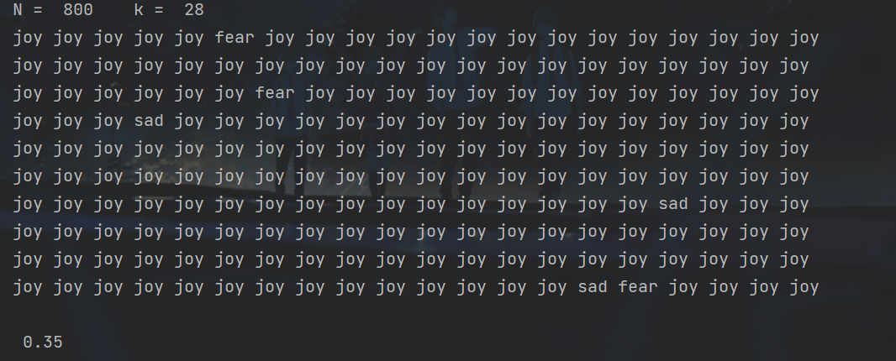
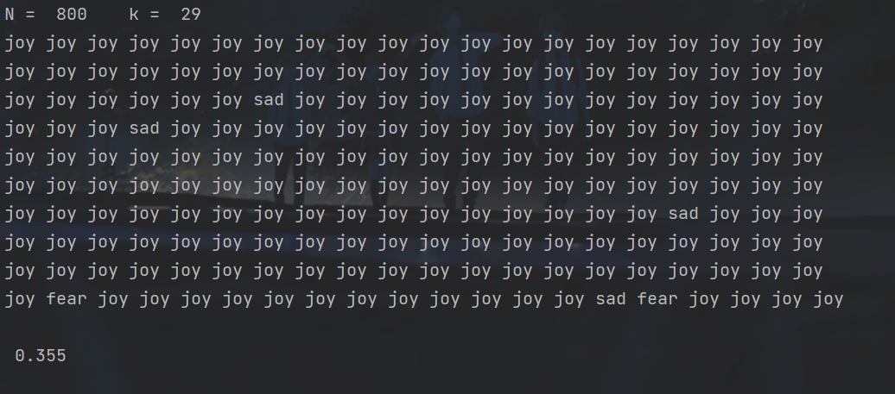
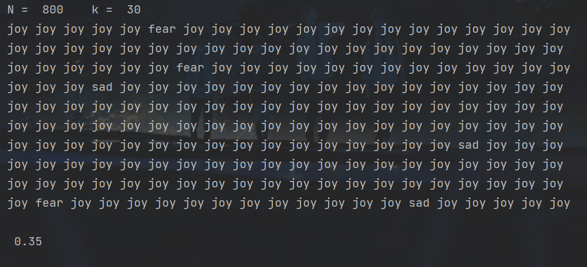
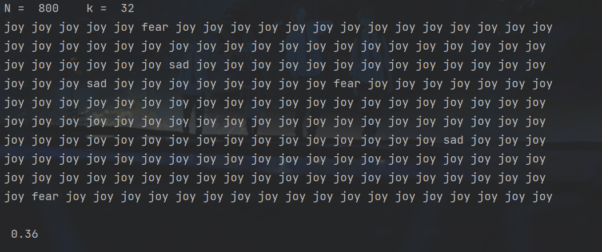
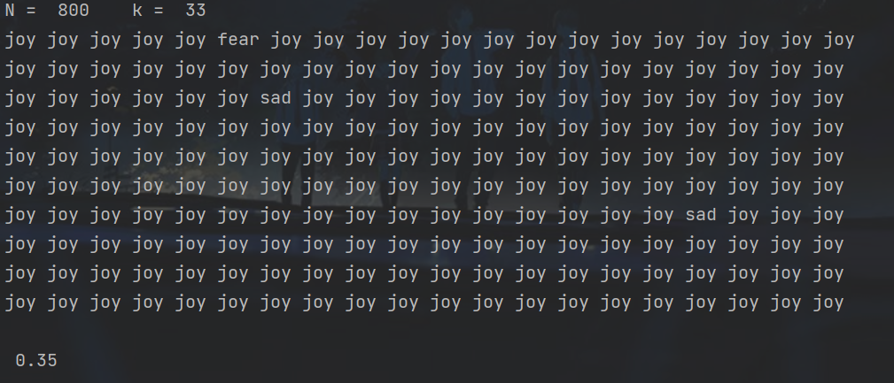
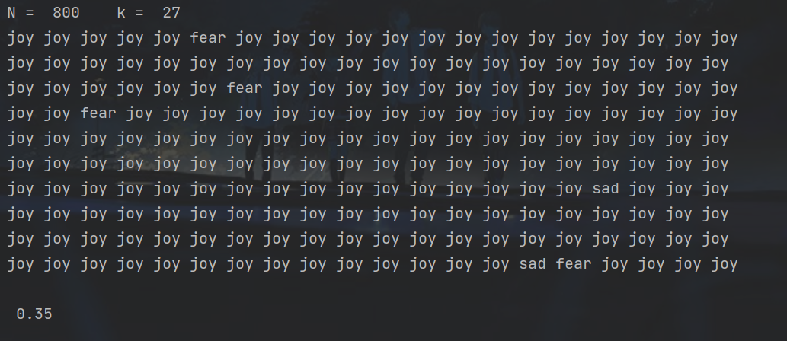
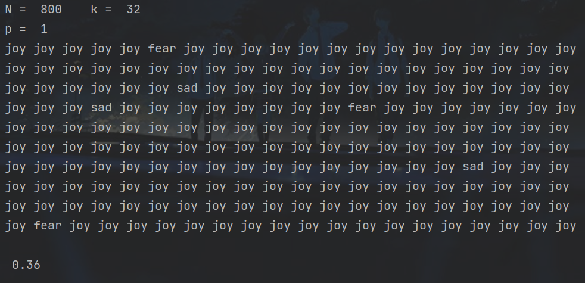
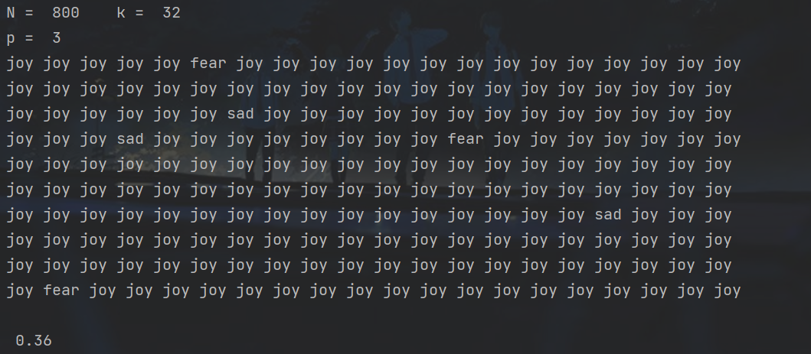
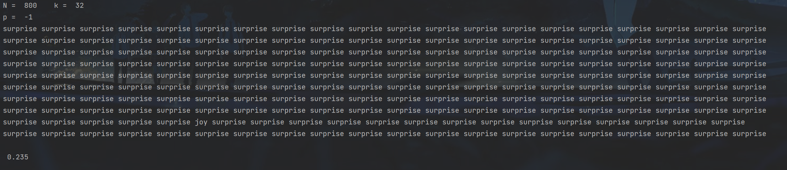
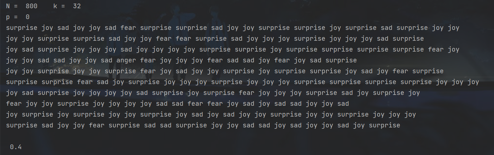

# 中山大学计算机学院

## 人工智能实验报告

课程名称：Artificial Intelligence

| 教学班级 | 超算班      | 专业  | 信息与计算科学 |
|:----:|:--------:|:---:|:-------:|
| 学号   | 21307261 | 姓名  | 王健阳     |

### 一，实验题目

    文本处理与KNN

### 二，实验内容

#### 算法原理

       先对训练集进行处理，提取出训练集每个句子的特征并统一化为$one-hot$矩阵。对于测试集的每一个句子，先把其处理为与训练集一样表示的$one-hot$向量，再计算两者之间的距离（此处可采用多种距离定义），对于测试集的一个句子对应的N个距离，取前k个作为我们的参考集合，取其中情绪的众数作为预测值。

#### 伪代码

```
# 读取文件
train_data, test_data = readfile()
# 将数据集统一为one-hot向量矩阵
matrix = data_processing(train_data)
cnt = 0
# 遍历测试集每一个句子
for sentence in test_data:
    # 转化为one-hot向量
    vec = convert(sentence)
    distance_list = []
    for row in matrix:
        dis = GetDis(row, vec)
        distance_list.append(dis)
    # 排序并取前k个作为参考集合
    distance_list.sort()
    container = distance_list[:k]
    # 如果参考集合里面的众数等于实际情感，则预测成功
    if sentence.emotion == GetMode(container):
        cnt += 1
```

#### 关键代码展示

```python
import numpy as np
from sklearn.feature_extraction.text import CountVectorizer, TfidfVectorizer
import math


p = -1


# 计算两向量之间的距离
def GetDistance(vec1, vec2):
    global p
    distance = 0.0
    dist_vec = vec1 - vec2
    # p-范数
    if p > 0:
        for i in range(len(dist_vec)):
            distance += math.fabs(dist_vec[i]) ** p
        distance = distance ** (1 / p)
    # 无穷范数
    elif p < 0:
        for i in range(len(dist_vec)):
            distance = math.fabs(dist_vec[i]) if math.fabs(dist_vec[i]) > distance else distance
    # 余弦表示法，模采取2-范数
    else:
        numerator = 0
        len1, len2 = 0, 0
        for i in range(len(vec1)):
            numerator += vec1[i] * vec2[i]
            len1 += vec1[i] ** 2
            len2 += vec2[i] ** 2
        distance = - (numerator / math.sqrt(len1 * len2))
        # print(distance)
    return distance


# 数据初始化
def DataInit():
    file_test = open('Classification/test.txt', 'r').read().split('\n')[1:-1]
    data = []
    for item in file_test:
        temp = item.split(' ')
        data.append([temp[2], ' '.join(temp[3:])])
    return data


class KNN:
    accuracy = 0.0

    def __init__(self, data):
        # 将训练集测试集句子放在一起提取特征，避免出现测试集单词训练集中不存在的情况
        # 此举便于向量匹配
        self.N = round((len(data)) * 0.8)
        self.k = round(math.sqrt(self.N)) + 4

        self.data = data
        cv = CountVectorizer()
        cv_fit = cv.fit_transform(np.array(self.data)[:, 1])
        self.train_emotion = np.array(self.data[:self.N])[:, 0]
        self.test_emotion = np.array(self.data[self.N:])[:, 0]
        self.name_list = cv.get_feature_names_out()
        self.matrix = cv_fit.toarray()

        print('N = ', self.N, '  ', 'k = ', self.k)
        print('p = ', p)

    def Solution(self):
        denominator, numerator = len(self.data) - self.N, 0
        cnt = 0
        for i in range(denominator):
            # emotion_predict = self.Predict(i)
            # 对于测试集里的每一个句子，进行情感预测
            emotion_predict = self.Predict(i)
            if emotion_predict == self.test_emotion[i]:
                numerator += 1
            cnt += 1
            print(emotion_predict, end=' ' if cnt % 20 != 0 else '\n')
        self.accuracy = round(numerator / denominator, 5)
        print('\n', self.accuracy)

    def Predict(self, sentence_index):
        emo_dict = {'anger': 0, 'disgust': 0, 'fear': 0, 'surprise': 0, 'sad': 0, 'joy': 0}
        # 获得待预测句子的one-hot向量
        vec = self.matrix[sentence_index + self.N]
        container = []
        for index, train_vec in enumerate(self.matrix[:self.N]):
            temp = [index, GetDistance(vec, train_vec), self.train_emotion[index]]
            container.append(temp)
        # 进行排序并保留前k个样本
        container.sort(key=lambda x: x[1])
        # print(container[:self.k])
        for item in container[:self.k]:
            emo_dict[item[2]] += 1
        return list(emo_dict.keys())[list(emo_dict.values()).index(max(list(emo_dict.values())))]


if __name__ == '__main__':
    Data = DataInit()
    solution = KNN(Data)
    solution.Solution()
```

#### 创新点 & 优化

        将训练集与测试集一起提取特征，避免了进行向量匹配时不匹配项的出现。哪怕测试集中存在训练集中没有的单词，也可以直接进行运算。

### 三，实验结果及分析

        在给定的文本数据集（Classification.zip）完成文本情感分类训练，在测试集完成测试，计算准确率。需要对上次给的数据集（Classification.zip）进行重新划分，训练集：测试集为8：2。故以下的输出是基于`test.txt`句子按照$训练：测试 = 8：2$来运行的

##### 算法结果展示实例

###### 超参k对准确率的影响

以下为p固定取2的时候，对超参k取值的分析

k初始值设为28，约为$N^\frac{1}{2}$



> k逐渐增大









> k逐渐减小



经过考察发现，k取32的时候有局部最优解。

###### 距离度量考察

以下探究在k取32的前提下，改变距离度量方式对正确率的影响

> p = 1



> p = 3



> p = $+\infty$



> 余弦相似度



可以看出，在选择余弦相似度作为测量依据的时候，测量准确率相对最高。 

##### 评测指标展示及分析

        不难看出，k在取到32的时候会有最大值0.36。故根据此次训练集训练出来的模型，在选择余弦相似度作为测量依据，k取32的时候，测试集得到的准确率最高。最后优化之后的正确率保持在0.4左右。

### 四，思考题

此次实验没有思考题

### 五，参考资料

1.实验python基础pdf

2.CSDN
