# 中山大学计算机学院

## 人工智能实验报告

课程名称：Artificial Intelligence

| 教学班级 | 超算班      | 专业  | 信息与计算科学 |
|:----:|:--------:|:---:|:-------:|
| 学号   | 21307261 | 姓名  | 王健阳     |

### 一，实验题目

    K-means 无监督学习

### 二，实验内容

#### 伪代码

评估函数：

$\qquad \qquad \sum_{i=0}^k\sum_{P \in cluster_k}|P-\mu_k|$

> K-means

        提供N个不带标签的训练数据。

1. 随机生成k个中心点（k值需要额外指定，中心点也不必是数据集中的点）。

2. 对于训练集的每一个点，计算其与每个中心点的距离，并将其归入距离最近的簇中。

3. 对于每个簇，更新其中心点的坐标为簇内所有点坐标的平均值

重复2，3，直到某次分类后的评估值不小于分类前，则终止循环

> K-means++

选取k个中心点：

1. 从N个数据点中随机选一个作为第一个中心点

2. 对于剩余的数据点，设它与距离最近中心点之间的距离$D_i$。后续从剩余点中按概率随机选取下一个中心点。每个点被选中的概率为$\frac{D_i^2}{\sum_{j=0}^ND_j^2}$ 

3. 重复上述操作k - 1次，最后完成k个中心点的初始化

初始化后的步骤与K-means一致

#### 关键代码展示

```python
import numpy as np
from copy import deepcopy
from sklearn.manifold import TSNE
from sklearn.feature_extraction.text import CountVectorizer, TfidfVectorizer, HashingVectorizer
from sklearn.metrics import calinski_harabasz_score
import matplotlib.pyplot as plt
import random
emotion = {'anger': 0, 'disgust': 1, 'fear': 2, 'surprise': 3, 'sad': 4, 'joy': 5}
tsne = TSNE(n_components=2)
fe_state = 'c'


# 返回[a, b]之间的任意实数
def rand(a, b):
    t = random.random()
    return a + (b - a) * t


# 获取任意两n维向量之间的距离
def GetDistance(v1, v2):
    p = 2
    if len(v1) != len(v2):
        raise 'length error'
    result = 0.0
    for i in range(len(v1)):
        result += (v1[i] - v2[i]) ** p
    return result ** (1 / p)


# 一个簇类
class Cluster:
    def __init__(self, location):
        self.location = location
        self.points = []
        self.index_list = []
        self.size = 0

    # 往该簇内添加点
    def AddPoint(self, point, index):
        self.points.append(point)
        self.index_list.append(index)
        self.size += 1

    # 返回该簇的得分：簇内各点到中心点的距离之和
    def GetScore(self):
        score = 0.0
        for point in self.points:
            score += GetDistance(point, self.location)
        return score

    # 返回簇内中心点坐标
    def Locate(self):
        return self.location

    # 清空簇内信息，等待下一轮分配
    def clear(self):
        self.points.clear()
        self.index_list.clear()
        self.size = 0

    # 更新簇内中心点坐标
    def SetPos(self, location):
        self.location = location


# K-means方法类
class Kmeans:
    cluster_list = []
    cluster_location_list = []
    fe_type = 'CountVectorizer' if fe_state == 'c' else \
        'TfidfVectorizer' if fe_state == 't' else \
        'HashingVectorizer' if fe_state == 'h' else 'null'
    cnt = 0

    def __init__(self, data_matrix, state='K-means++'):
        self.data_matrix = data_matrix
        self.point_dimension = len(data_matrix[0])
        self.N = len(data_matrix)
        self.k = 6
        # 簇中心点初始化
        self.CentroidInitialize(state)

        pre = float("inf")
        while True:
            print('%d times kmeans start:' % (self.cnt + 1))
            self.PointsSorting()
            for i in range(self.k):
                print('point nums of cluster %d:' % (i + 1), len(self.cluster_list[i].points))
                pass
            # print('centroids:', self.cluster_location_list)
            print('----------------------------------')
            nxt = self.GetScore()
            if pre <= nxt:
                break
            pre = nxt
            self.CentroidReset()
            self.cnt += 1
        # 将结果降维可视化输出
        self.Visualize(state, self.cnt + 1)

    # 中心点初始化
    def CentroidInitialize(self, state):
        if state == 'K-means++':
            temp: list = deepcopy(self.data_matrix)
            # 随机选取一个点作为中心点
            first = random.randint(0, self.N - 1)
            self.cluster_location_list.append(temp[first])
            self.cluster_list.append(Cluster(temp[first]))
            del list(temp)[first]
            # 选取接下来的k - 1个中心点
            for _ in range(self.k - 1):
                # 计算剩余每个点到最近中心点的距离
                min_dis_list = []
                denominator = 0.0
                for point in temp:
                    min_dist = float("inf")
                    for centroid in self.cluster_location_list:
                        if min_dist > GetDistance(point, centroid):
                            min_dist = GetDistance(point, centroid)
                    min_dis_list.append(min_dist)
                    denominator += min_dist ** 2
                # 根据距离加权计算概率，并依据概率选取下一个点
                key_value = random.random()
                basic = 0.0
                for index in range(len(temp)):
                    # 如果此时key_value的值落在[basic, basic + prob[index]]区间内，则说明index点被选中
                    if key_value < basic + (min_dis_list[index] ** 2) / denominator:
                        self.cluster_location_list.append(temp[index])
                        self.cluster_list.append(Cluster(temp[index]))
                        del list(temp)[index]
                        break
                    basic += (min_dis_list[index] ** 2) / denominator
            print('K-means++ initialization ends.')
        else:
            # 随机生成k个簇，并为其分配唯一的簇标识符（索引）
            for _ in range(self.k):
                location = []
                for i in range(self.point_dimension):
                    xis = self.data_matrix[:, i]
                    location.append(rand(min(xis), max(xis)))
                self.cluster_list.append(Cluster(location))
                self.cluster_location_list.append(location)

    # 对点进行分类
    def PointsSorting(self):
        # 对于每一个数据点，计算出距离其最近的簇中心点以及最短距离
        for _index, point in enumerate(self.data_matrix):
            min_dist, min_index = float("inf"), 0
            for index, cluster in enumerate(self.cluster_list):
                dis = GetDistance(point, cluster.Locate())
                if min_dist > dis:
                    min_dist = dis
                    min_index = index
            # empty
            self.cluster_list[min_index].AddPoint(point, _index)

    # 更新每个簇的中心点坐标
    def CentroidReset(self):
        self.cluster_location_list.clear()
        for cluster in self.cluster_list:
            if cluster.size == 0:
                # 如果该簇为空，则无需更新
                self.cluster_location_list.append(cluster.location)
                continue

            new_location = []
            for i in range(self.point_dimension):
                new_xi = 0
                for point in cluster.points:
                    new_xi += point[i]
                new_xi /= cluster.size
                new_location.append(new_xi)
            cluster.clear()
            cluster.SetPos(new_location)
            self.cluster_location_list.append(new_location)

    # 返回此时的评估分数
    def GetScore(self):
        score = 0.0
        for cluster in self.cluster_list:
            score += cluster.GetScore()
        return score

    # 结果可视化
    def Visualize(self, state, n):
        print('while end\n')
        print('feature extraction: ' + self.fe_type + '(' + ('K-means++' if state == 'K-means++' else 'K-means') + ')')

        # 对数据点以及最终k个中心点进行降维处理
        tsne.fit_transform(self.data_matrix)
        _2D_data_points = tsne.embedding_
        xs, ys = _2D_data_points[:, 0], _2D_data_points[:, 1]
        # ------------------------------------------------------------------
        # 获取当前数据点的所属簇信息，即代表其暗含的情感
        emo_nums = self.GetDistribution()
        print('points:', calinski_harabasz_score(_2D_data_points, emo_nums))
        # 打印kmeans之后的分布
        plt.title("%d times kmeans" % n)
        plt.scatter(xs, ys, c=emo_nums, s=10)
        plt.show()

    # 获取此时每个点的所属簇信息，用以计算calinski_harabasz_score以及可视化输出
    def GetDistribution(self):
        emo_nums = []
        for i in range(self.N):
            emo_nums.append(None)
        for _index, cluster in enumerate(self.cluster_list):
            for index, point in enumerate(cluster.points):
                emo_nums[cluster.index_list[index]] = _index
        return emo_nums


# 输入数据初始化
def DataInit():
    global fe_state
    sentences, emotions = [], []
    file_txt = open('train.txt').read().split('\n')[1:-1]
    for line in file_txt:
        temp = line.split(' ')
        sentences.append(' '.join(temp[3:]))
        emotions.append(emotion[temp[2]])

    if fe_state == 'c':
        cv = CountVectorizer()
    elif fe_state == 't':
        cv = TfidfVectorizer()
    elif fe_state == 'h':
        cv = HashingVectorizer()
    else:
        print('wrong type!')
        return
    cv_fit = cv.fit_transform(np.array(sentences))
    matrix = cv_fit.toarray()
    return matrix, emotions


if __name__ == '__main__':
    DataMatrix, EmotionNums = DataInit()
    flag = 0
    if flag:
        # 降维绘制实际点分布情况
        tsne.fit_transform(DataMatrix)
        points = tsne.embedding_
        x, y = points[:, 0], points[:, 1]
        plt.title('original data')
        plt.scatter(x, y, c=EmotionNums, s=10)
        plt.show()
    solution = Kmeans(DataMatrix)
```

#### 创新点 & 优化

    此次实验按照要求进行，暂无好的优化

### 三，实验结果及分析

##### 算法结果展示实例

> K-means

1.

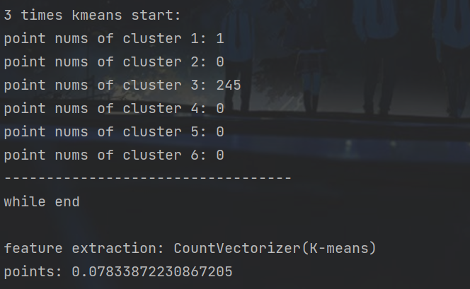

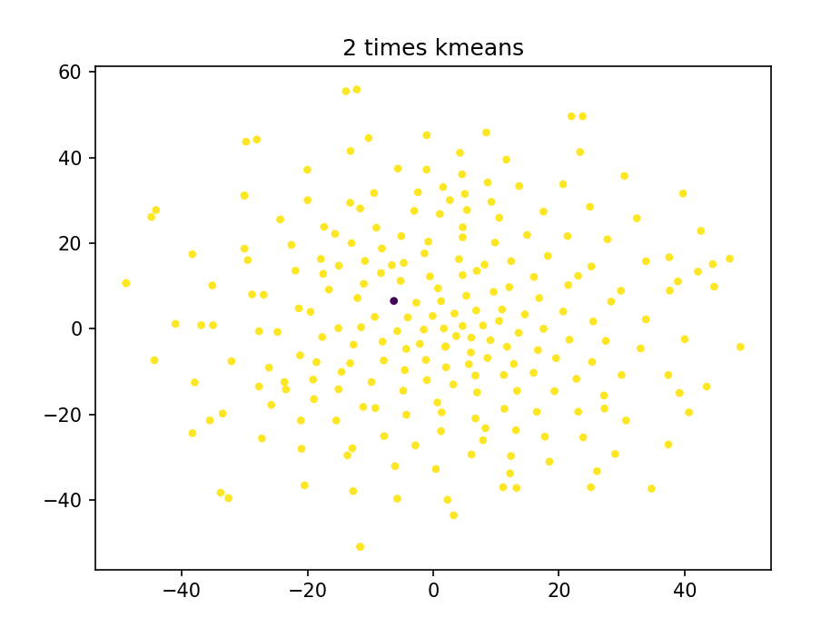

2.

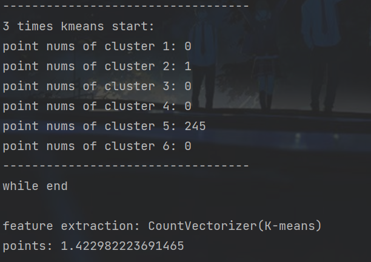

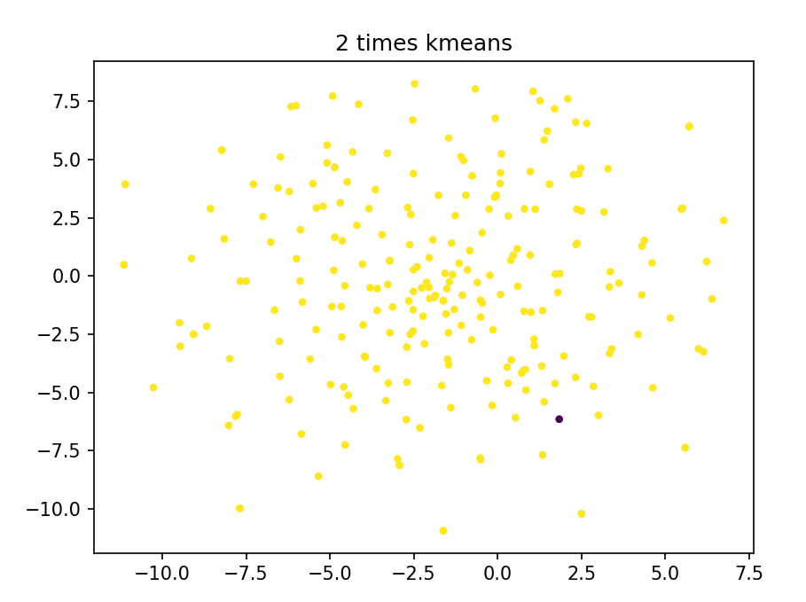

3.

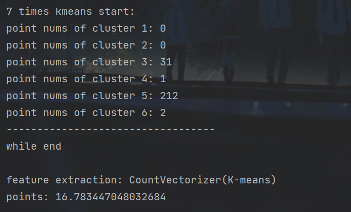

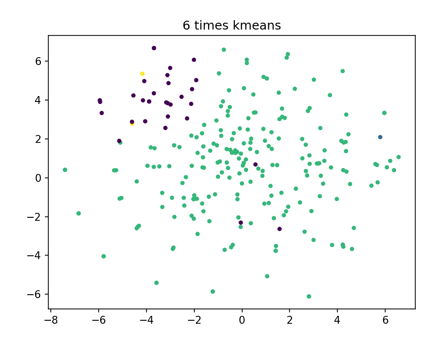

4.

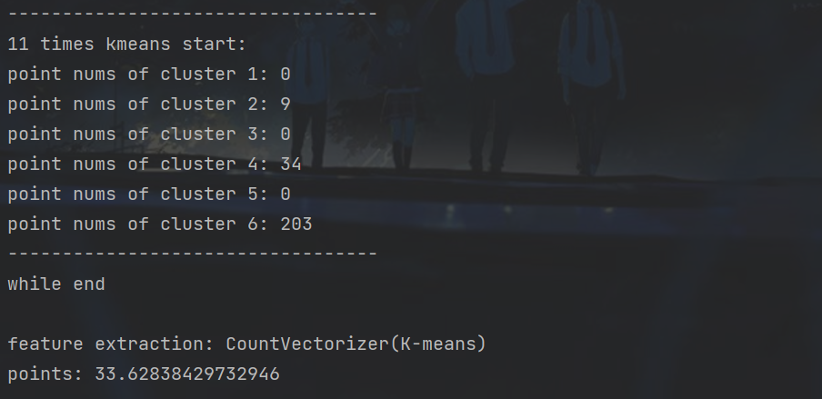

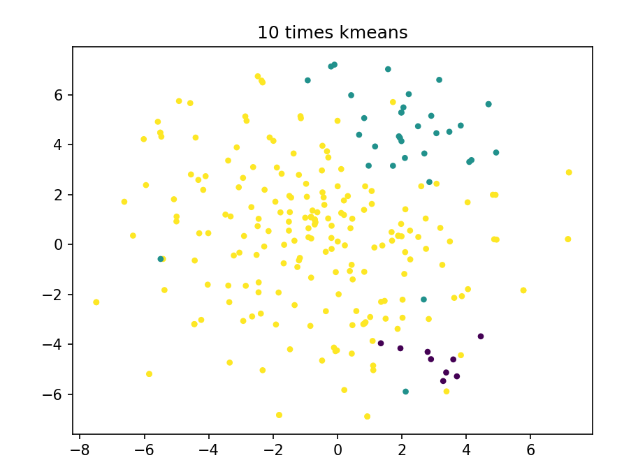

5.

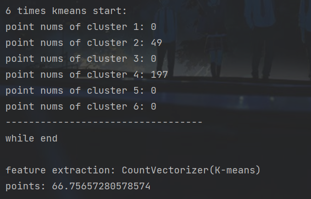

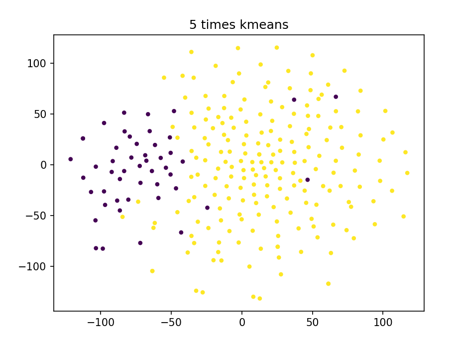

> K-means++

1.

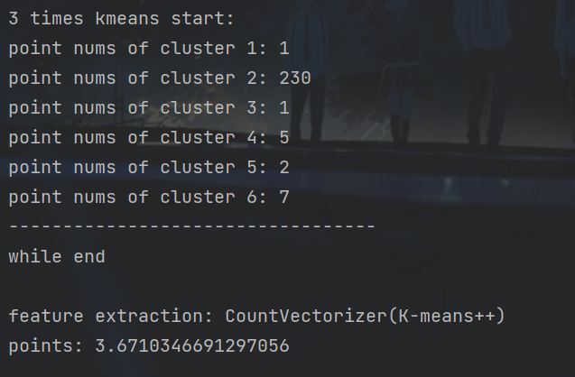

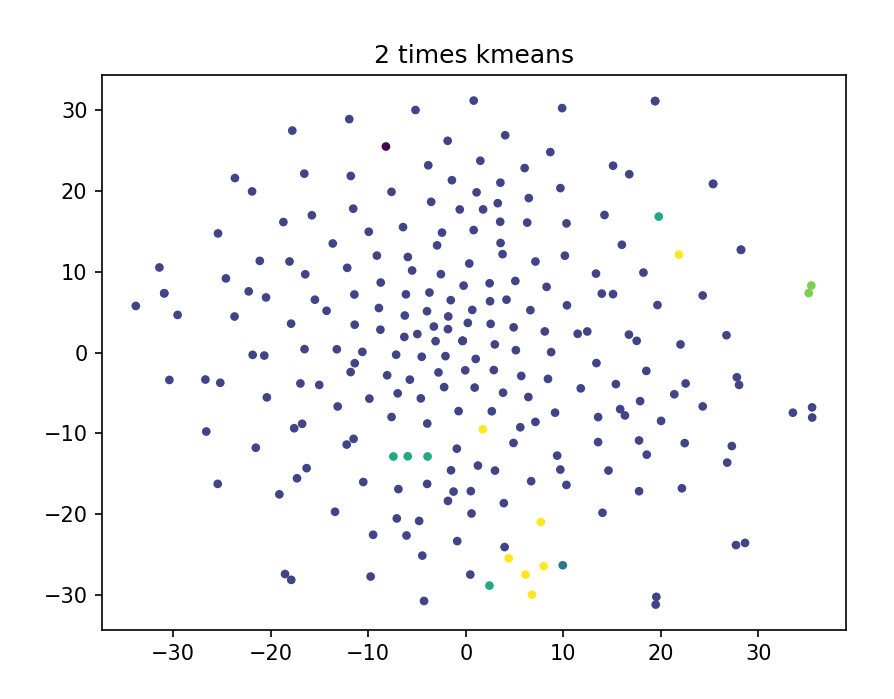

2.

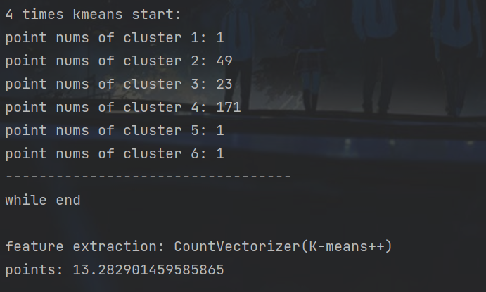

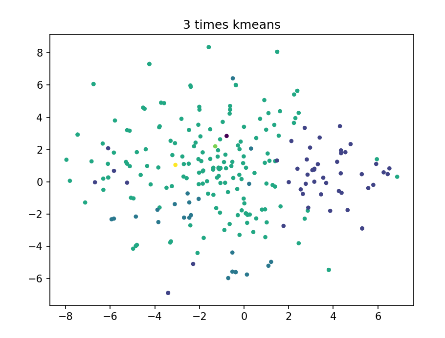

3.

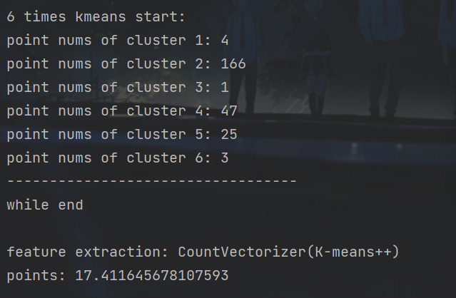

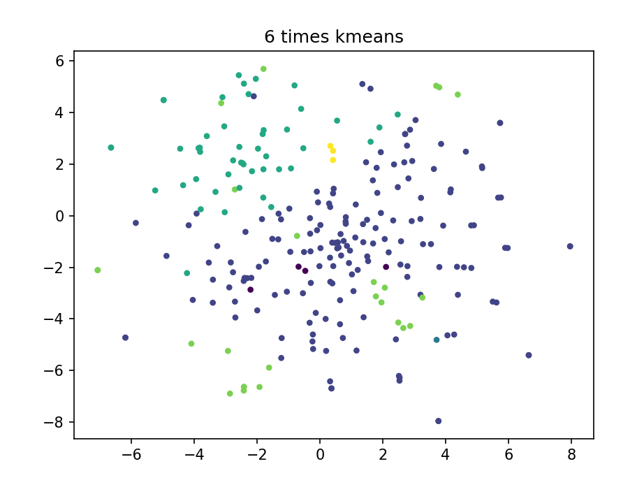

4.

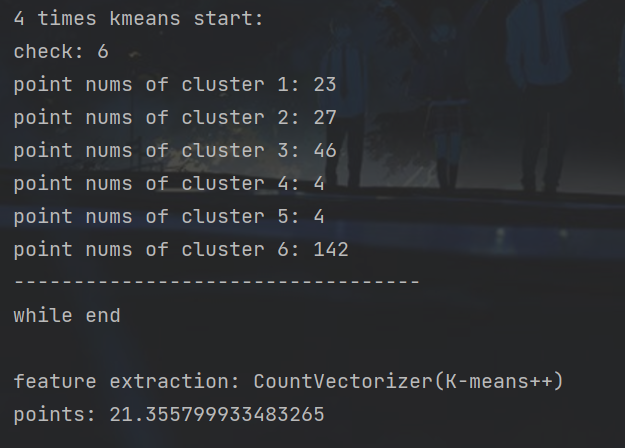

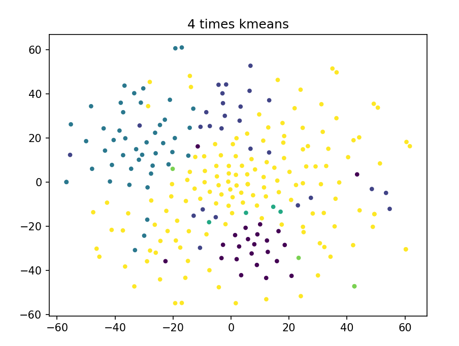

##### 评测指标展示及分析

        由于此次实验结果的随机性，故展示时均用了多组示例。从中不难看出，K-means的评估值上下限差距很大，初值依赖性很强。但由于随机初始化的特性，使得K-means在结果上不太稳定。并且K-means也往往很难起到真正的分类效果，经常会出现某个簇内没有数据点的情况。

        相比之下，K-means++就更加稳定。就结果而言，K-means++的差距明显缩小，并且每个类内的点分布也相对更平均，不容易出现K-means中的极端分布情况。

### 四，思考题

此次实验没有思考题

### 五，参考资料

1.实验python基础pdf

2.CSDN
