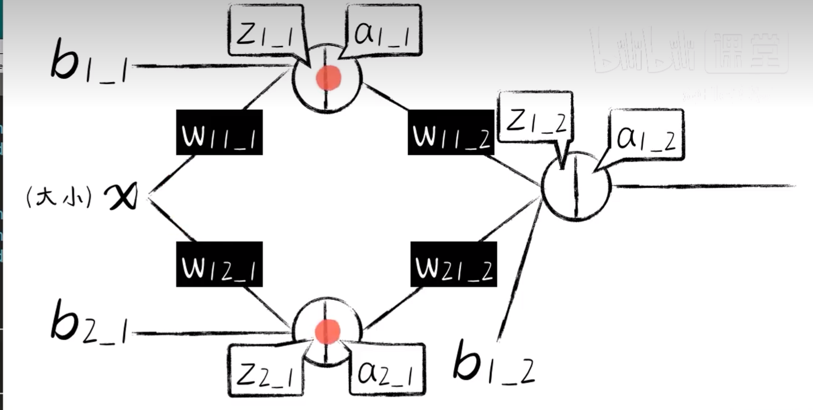
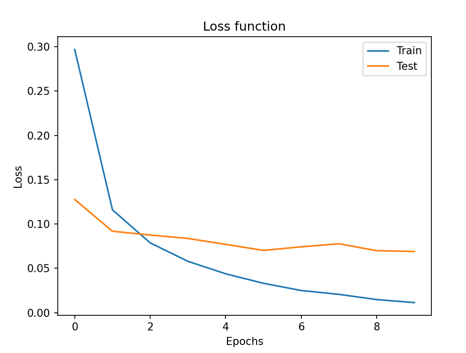
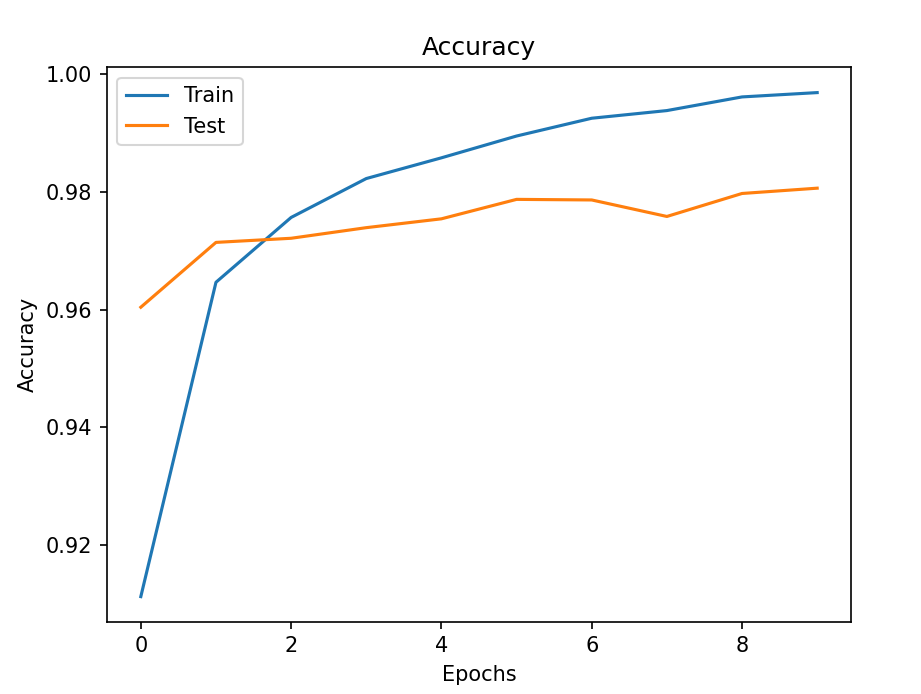
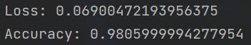
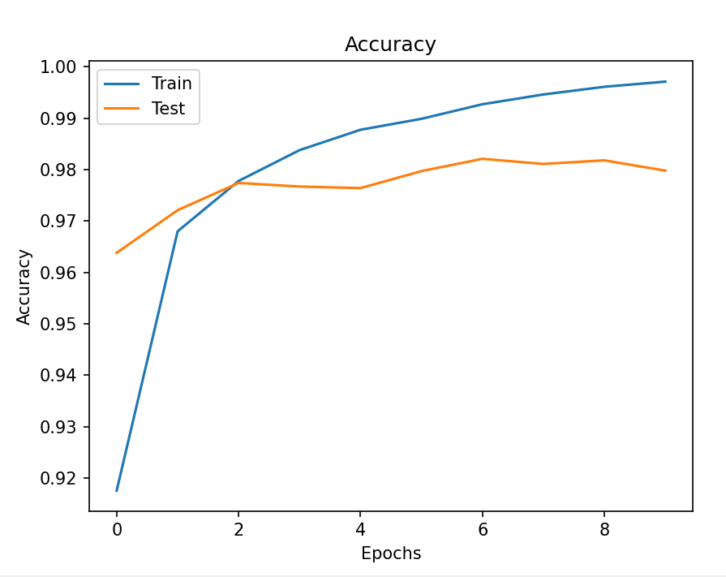
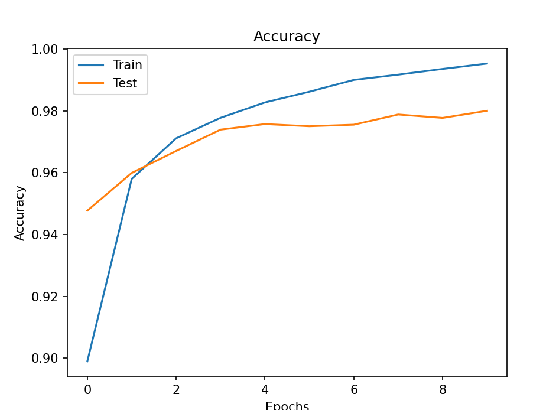
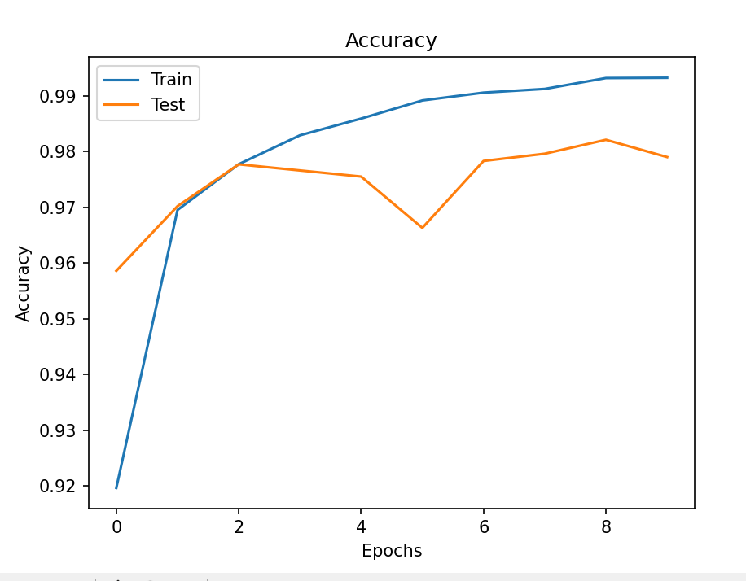
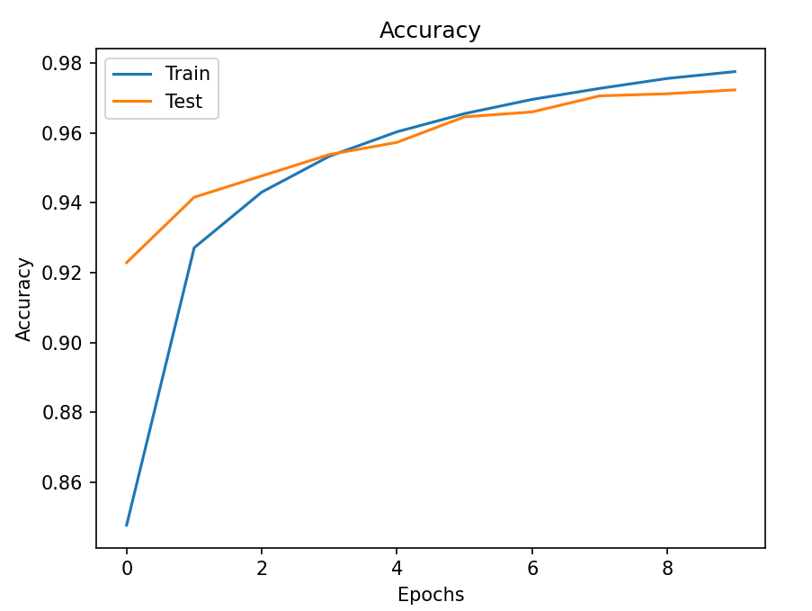
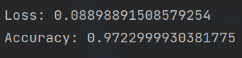

# 中山大学计算机学院

## 人工智能实验报告

课程名称：Artificial Intelligence

| 教学班级 | 超算班      | 专业  | 信息与计算科学 |
|:----:|:--------:|:---:|:-------:|
| 学号   | 21307261 | 姓名  | 王健阳     |

### 一，实验题目

    图像分类

### 二，实验内容

#### 算法原理

###### 简单神经网络推导

这是一个单层简单神经网络，采用`sigmoid`激活函数



> 前向传播

```python
def forward_propagation(xs):
    z1_1 = w11_1 * xs + b1_1
    a1_1 = sigmoid(z1_1)

    z2_1 = w12_1 * xs + b2_1
    a2_1 = sigmoid(z2_1)

    z1_2 = w11_2 * a1_1 + w21_2 * a2_1 + b1_2
    a1_2 = sigmoid(z1_2)
    return z1_1, a1_1, z2_1, a2_1, z1_2, a1_2
```

> 反向传播梯度下降

```python
for _ in range(5000):
    for i in range(100):
        x = xs[i]
        y = ys[i]
        # 前向传播
        z1_1, a1_1, z2_1, a2_1, z1_2, a1_2 = forward_propagation(x)
        # 反向传播
        e = (y - a1_2) ** 2
        # 第二层各导数
        deda1_2 = -2*(y - a1_2)
        da1_2dz1_2 = a1_2*(1 - a1_2)

        dz1_2dw11_2 = a1_1
        dz1_2dw21_2 = a2_1
        dz1_2db1_2 = 1

        dedw11_2 = deda1_2*da1_2dz1_2*dz1_2dw11_2
        dedw21_2 = deda1_2*da1_2dz1_2*dz1_2dw21_2
        dedb1_2 = deda1_2*da1_2dz1_2*dz1_2db1_2
        # 第一层各导数
        dedz1_2 = deda1_2*da1_2dz1_2

        dz1_2da1_1 = w11_2
        dz1_2da2_1 = w21_2
        da1_1dz1_1 = a1_1*(1 - a1_1)
        da2_1dz2_1 = a2_1*(1 - a2_1)
        dz1_1dw11_1 = x
        dz2_1dw12_1 = x
        dz1_1db1_1 = 1
        dz2_1db2_1 = 1

        dedw11_1 = dedz1_2*dz1_2da1_1*da1_1dz1_1*dz1_1dw11_1
        dedw12_1 = dedz1_2*dz1_2da2_1*da2_1dz2_1*dz2_1dw12_1
        dedb1_1 = dedz1_2*dz1_2da1_1*da1_1dz1_1*dz1_1db1_1
        dedb2_1 = dedz1_2*dz1_2da2_1*da2_1dz2_1*dz2_1db2_1
        # 参数更新
        alpha = 0.03
        w11_1 -= alpha * dedw11_1
        w12_1 -= alpha * dedw12_1
        b1_1 -= alpha * dedb1_1
        b2_1 -= alpha * dedb2_1

        w11_2 -= alpha * dedw11_2
        w21_2 -= alpha * dedw21_2
        b1_2 -= alpha * dedb1_2
```

        可以看出，若采取纯手工实现反向传播梯度下降十分繁琐，需要频繁地求导分析。很容易出现错误。故以下实际应用代码采用`keras`框架搭建神经网络来训练。

#### 关键代码展示

        考虑到输入灰度图拉平后是一个784维的向量，所以这里搭建了一个三层神经网络，每层255个神经元。最后再用十个神经元搭建最后一层输出层，对应0\~9的标签。

```python
from keras.datasets import mnist
from keras.models import Sequential
# 堆叠神经网络的载体
from keras.layers import Dense
# 全连接层，可作为一层神经网络（两个神经元的隐藏层就是一个Dense）
from keras.optimizers import SGD
import matplotlib.pyplot as plt
from keras.utils import to_categorical

(X_train, Y_train), (X_test, Y_test) = mnist.load_data()

print("X_train.shape: " + str(X_train.shape))
print("Y_train.shape: " + str(Y_train.shape))
print("X_test.shape: " + str(X_test.shape))
prit("Y_test.shape: " + str(Y_test.shape))

print(Y_train[0])
plt.imshow(X_train[0], cmap='gray')
plt.show()

X_train = X_train.reshape(60000, 784) / 255.0
X_test = X_test.reshape(10000, 784) / 255.0

Y_train = to_categorical(Y_train, 10)
Y_test = to_categorical(Y_test, 10)


model = Sequential()
model.add(Dense(units=255, activation='relu', input_dim=784))
model.add(Dense(units=255, activation='relu'))
model.add(Dense(units=255, activation='relu'))
# model.add(Dense(units=8, activation='relu'))
model.add(Dense(units=10, activation='softmax'))
model.compile(loss='categorical_crossentropy', optimizer=SGD(lr=0.06), metrics=['accuracy'])


history = model.fit(X_train, Y_train, epochs=10, validation_data=(X_test, Y_test))
# history = model.fit(X_train, Y_train, epochs=100, batch_size=1024)
# 可视化损失函数
plt.plot(history.history['loss'])
plt.plot(history.history['val_loss'])
plt.xlabel('Epochs')
plt.ylabel('Loss')
plt.legend(['Train', 'Test'])
plt.title('Loss function')
plt.show()
# 可视化准确率
plt.plot(history.history['accuracy'])
plt.plot(history.history['val_accuracy'])
plt.xlabel('Epochs')
plt.ylabel('Accuracy')
plt.legend(['Train', 'Test'])
plt.title('Accuracy')
plt.show()
# 计算测试集准确率并输出
loss, accuracy = model.evaluate(X_test, Y_test)
print("Loss:", loss)
print("Accuracy:", accuracy)
```

#### 创新点 & 优化

暂无

### 三，实验结果及分析

##### 算法结果展示实例

loss函数曲线：



accuracy函数曲线：

\

最终结果如下所示：



##### 评测指标展示及分析

学习率取0.08时的结果如下：



学习率取0.04时的结果如下：



学习率取0.3时的结果如下：



学习率取0.01时的结果如下：





        不难看出，学习率在0.04\~0.08之间时候比较稳定，且可以保持较高的准确率。当学习率过大的时候，例如0.3时，可以明显看出图像波动变大，说明可能拟合结果在最优解附近左右横跳；而当学习率太小时，可以明显看到图像变得平缓，更加稳定。但与之相对的是梯度下降速度太慢，导致最后的准确率也有下降。

### 四，思考题

此次无思考题

### 五，参考资料

1.实验python基础pdf

2.CSDN
