# 中山大学计算机学院

## 人工智能实验报告

课程名称：Artificial Intelligence

| 教学班级 | 超算班      | 专业  | 信息与计算科学 |
|:----:|:--------:|:---:|:-------:|
| 学号   | 21307261 | 姓名  | 王健阳     |

### 一，实验题目

    运用pytorch完成药品分类

要求：

- 运用pytorch框架完成中药图片分类，具体见给出的训练集和测试集(data.zip)

- 需要画出loss、准确率曲线图。

### 二，实验内容

#### 算法原理

       调用`torch`来搭建神经网络，实现对药图片的分类

> 核心问题

- 数据导入

- 网络（模型）搭建

- 模型训练

- 输出结果（结果可视化）

#### 伪代码

（主要是训练部分）

```
for epoch in total_times:
    for pic, label in train_data:
        input_data = convert(pic)
        pred = model(input_data)
        loss = judge(pred, label)
        
        backward()
        parameter.update()
    
    correct = 0
    for pic, label in test_data:
        input_data = convert(pic)
        pred = model(data)
        label_pred = argmax(pred)
        if label_pred == label:
            correct += 1
    print(correct / total)
```

#### 关键代码展示

> 自定义数据集

```python
# 输入为：data/train, data/test
class MyDataset(Dataset):
    def __init__(self, root, resize):
        super(MyDataset, self).__init__()
        self.images_path, self.labels = [], []
        self.root = root
        self.resize = resize

        # 获取到每一个图片的路径
        for i, name in enumerate(sorted(os.listdir(os.path.join(root)))):
            cur_dir = os.path.join(root, name)
            if not os.path.isdir(cur_dir):
                continue

            temp = [os.path.join(root, name, imgdir) for imgdir in os.listdir(cur_dir)]
            self.images_path.extend(temp)
            self.labels.extend([i] * len(os.listdir(cur_dir)))
        assert len(self.images_path) == len(self.labels), 'unknown error'

    def __len__(self):
        return len(self.images_path)

    def __getitem__(self, idx):
        img, label = self.images_path[idx], self.labels[idx]

        tf = transforms.Compose([
            lambda x: Image.open(x).convert('RGB'),  # 根据路径获得彩图
            transforms.Resize((self.resize, self.resize)),  # 进行一些图像处理
            transforms.RandomRotation(0),
            transforms.CenterCrop(self.resize),
            transforms.ToTensor(),  # 将图片转为张量
            transforms.Normalize(mean=[0.485, 0.456, 0.406],  # 对应RGB通道
                                 std=[0.229, 0.224, 0.225])
        ])

        # 将图片，标签转为张量
        img = tf(img)
        label = torch.tensor(label)
        return img, label
```

> 两种神经网络结构

实践发现`stride`取1的时候显存会爆，所以只能取2

```python
# 自定义卷积神经网络层
class MyCNN(nn.Module):
    def __init__(self):
        super(MyCNN, self).__init__()
        self.stride = 2
        self.conv_unit = nn.Sequential(
            nn.Conv2d(3, 6, kernel_size=(5, 5), stride=(self.stride, self.stride)),
            nn.MaxPool2d(2, 2),
            nn.Conv2d(6, 16, kernel_size=(5, 5), stride=(self.stride, self.stride))
        )
        tmp = torch.randn(batch_size, 3, 224, 224)
        out = self.conv_unit(tmp)
        # out [batch_size, 16, 106/26, 106/26]
        print("out:", out.shape)
        assert True, "break"
        self.fc_input_dim = 16*106*106 if self.stride == 1 else 16*26*26
        self.fc_unit = nn.Sequential(
            nn.Linear(self.fc_input_dim, 1024),
            nn.ReLU(),
            nn.Linear(1024, 128),
            nn.ReLU(),
            nn.Linear(128, 5)
        )

    def forward(self, x):
        x = self.conv_unit(x)
        length = x.size(0)
        x = x.view(length, self.fc_input_dim)
        logits = self.fc_unit(x)
        return logits


# 搭建resnet18神经网络
class Resnet18(nn.Module):
    def __init__(self, classes=5):
        super(Resnet18, self).__init__()
        self.features = models.resnet18(pretrained=True)
        self.features.fc = nn.Linear(512, classes)

    def forward(self, x):
        x = self.features(x)
        return x
```

> 训练模型

```python
def main():
    # [batch, 3, len, wid]
    train_db = MyDataset('data\\train', 224)
    test_db = MyDataset('data\\test', 224)

    # assert False, 'break'
    train_loader = DataLoader(train_db, batch_size=batch_size, shuffle=True)
    test_loader = DataLoader(test_db, batch_size=batch_size, shuffle=False)
    ''' 测试输入输出维度的代码
    net = MyNet()
    tmp = torch.randn(32, 3, 224, 224)
    out = net(tmp)
    print('out:', out.shape)
    print('--------------------------------')
    '''

    # 令程序跑在GPU上，参数初始化
    assert torch.cuda.is_available(), 'cuda error'
    device = torch.device('cuda:0')
    # 选择模型并初始化
    if model_type:
        model = Resnet18().to(device)
    else:
        model = MyCNN().to(device)
    # 选择优化器并初始化
    criterion = nn.CrossEntropyLoss()
    if optim_type:
        optimizer = optim.Adam(model.parameters(), lr=learning_rate)
    else:
        optimizer = optim.SGD(model.parameters(), lr=learning_rate)
    # print(model)  # 打印模型参数

    # 开始训练
    for epoch in range(epoch_nums):
        train_average_loss, test_average_loss = 0.0, 0.0
        train_total_correct, test_total_correct = 0.0, 0.0
        train_total_num, test_total_num = 0.0, 0.0

        # train
        model.train()
        for batchidx, (x, label) in enumerate(train_loader):
            x, label = x.to(device), label.to(device)

            logits = model(x)
            pred = logits.argmax(dim=1)
            train_total_correct += torch.eq(pred, label).float().sum().item()
            train_total_num += x.size(0)
            # logits: [batch_size, 5], label: [batch_size]
            loss = criterion(logits, label)
            train_average_loss += loss.item()
            # 反向传播部分
            optimizer.zero_grad()
            loss.backward()
            optimizer.step()

        train_acc = train_total_correct / train_total_num
        train_average_loss /= len(train_loader)
        print('epoch', epoch, ': train_loss ->', train_average_loss, end='\t\t')
        print('epoch', epoch, ': train_accuracy ->', train_acc)
        loss_train_xs.append(epoch), loss_train_ys.append(train_average_loss)
        acc_train_xs.append(epoch), acc_train_ys.append(train_acc)


        # test 无需 backprop
        model.eval()
        with torch.no_grad():
            for x, label in test_loader:
                x, label = x.to(device), label.to(device)
                logits = model(x)
                pred = logits.argmax(dim=1)
                test_total_correct += torch.eq(pred, label).float().sum().item()
                test_total_num += x.size(0)

                loss = criterion(logits, label)
                test_average_loss += loss.item()

            test_acc = test_total_correct / test_total_num
            test_average_loss /= len(test_loader)
            print('epoch', epoch, ': test_loss ->', test_average_loss, end='\t\t')
            print('epoch', epoch, ': test_accuracy ->', test_acc)
            loss_test_xs.append(epoch), loss_test_ys.append(test_average_loss)
            acc_test_xs.append(epoch), acc_test_ys.append(test_acc)
            print('-------------------------------------------------------------')
```

> 可调整参数

```python
# 模型可调式参数
batch_size = 16
learning_rate = 0.001
epoch_nums = 20
model_type = 1  # 卷积网络或者resnet18
optim_type = 0  # Adam或者SCG优化器
```

#### 创新点 & 优化

1. 统一训练集测试集数据结构，方便统一读取

2. 设计两个网络模型以及多个可选参数，便于比较性能

3. 采取GPU运行，加速运行过程（本来没安装`cuda`)

### 三，实验结果及分析

        根据测试，发现`learning rate`取0.001，`batch_size`设为16时的效果较好。同时在设定的两个模型以及两种优化器中，卷积网络搭配`Adam`，`Resnet18`搭配`SGD`可以取得很好的效果。

> 卷积网络 + Adam

由于预测具有随机性，故展示三次运行结果

1


2

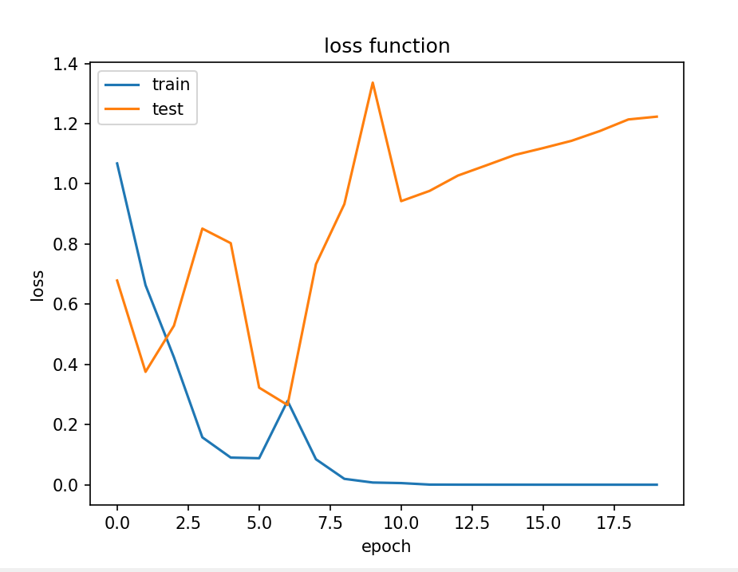

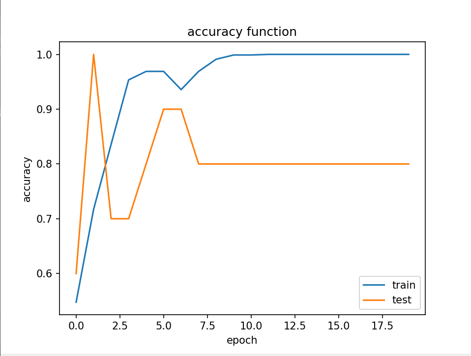

3

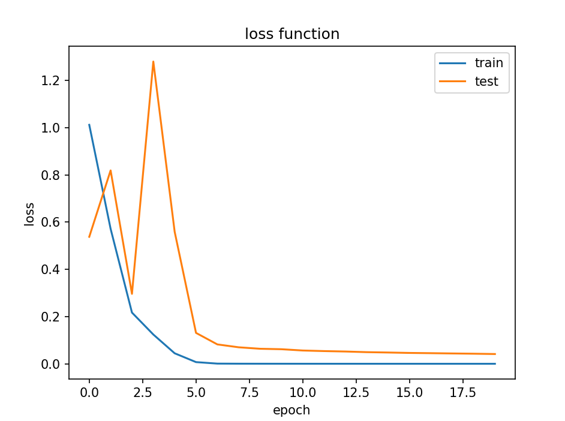

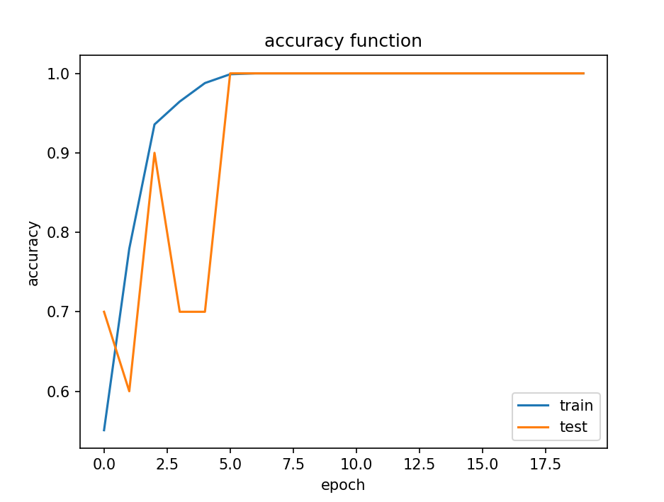

> `Resnet18`网络 + SGD

由于预测具有随机性，故展示三次运行结果

1

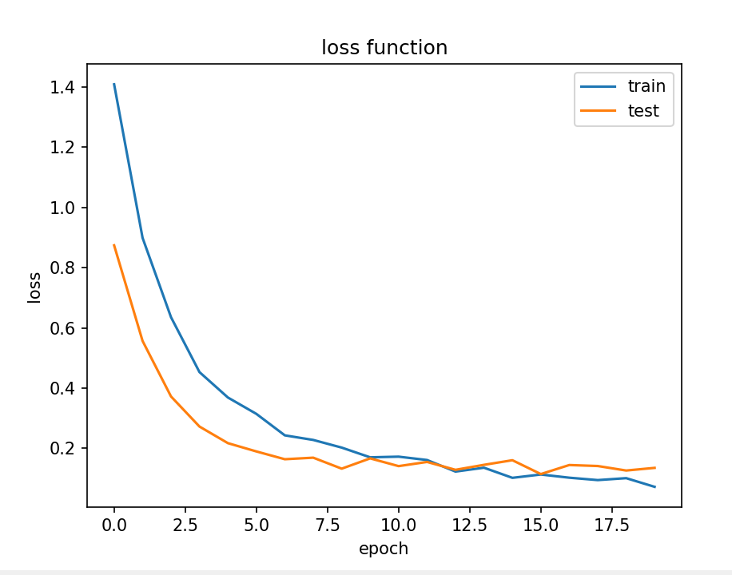

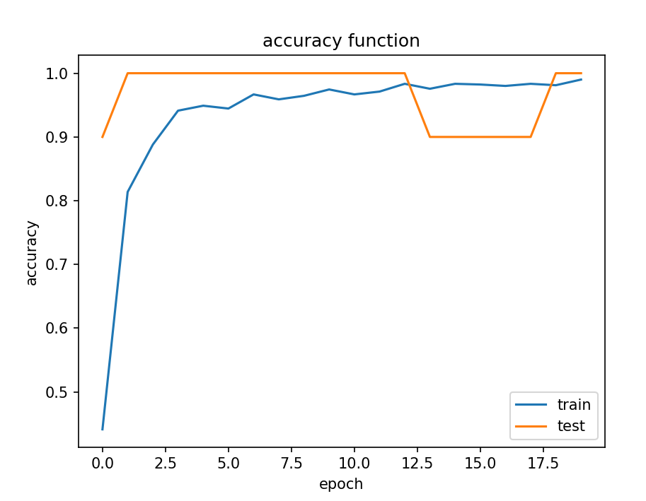

2

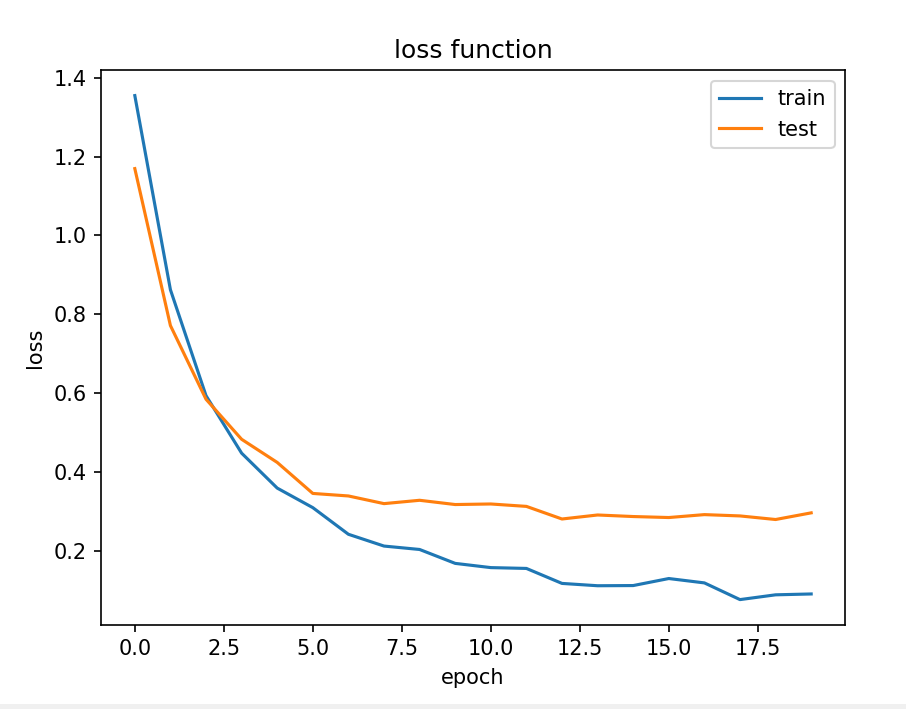

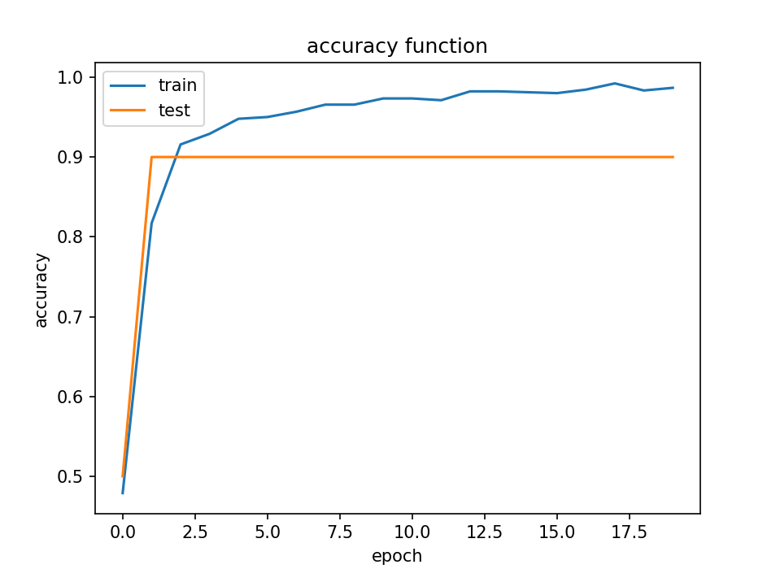

3

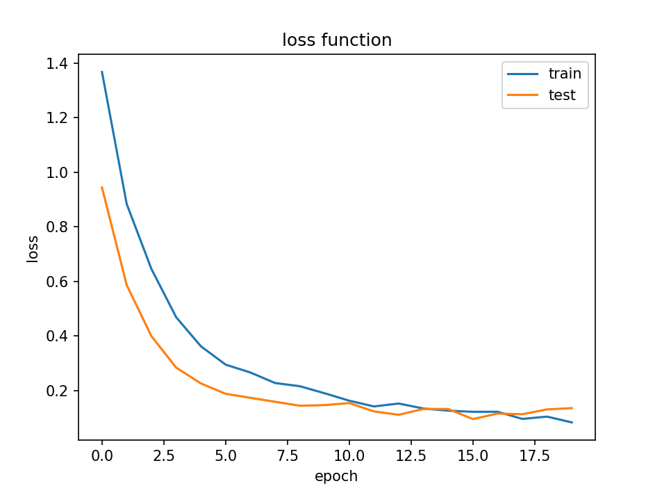

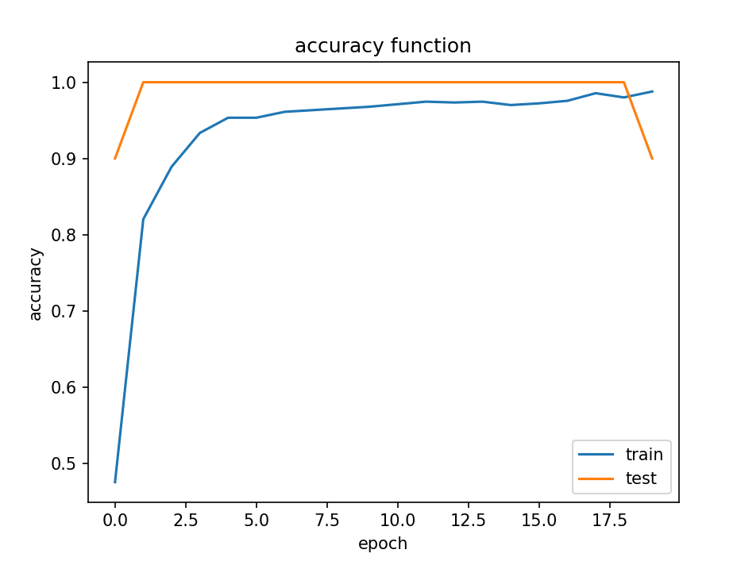

接下来说明如果混搭的后果：

> `Resnet18` 网络+ Adam

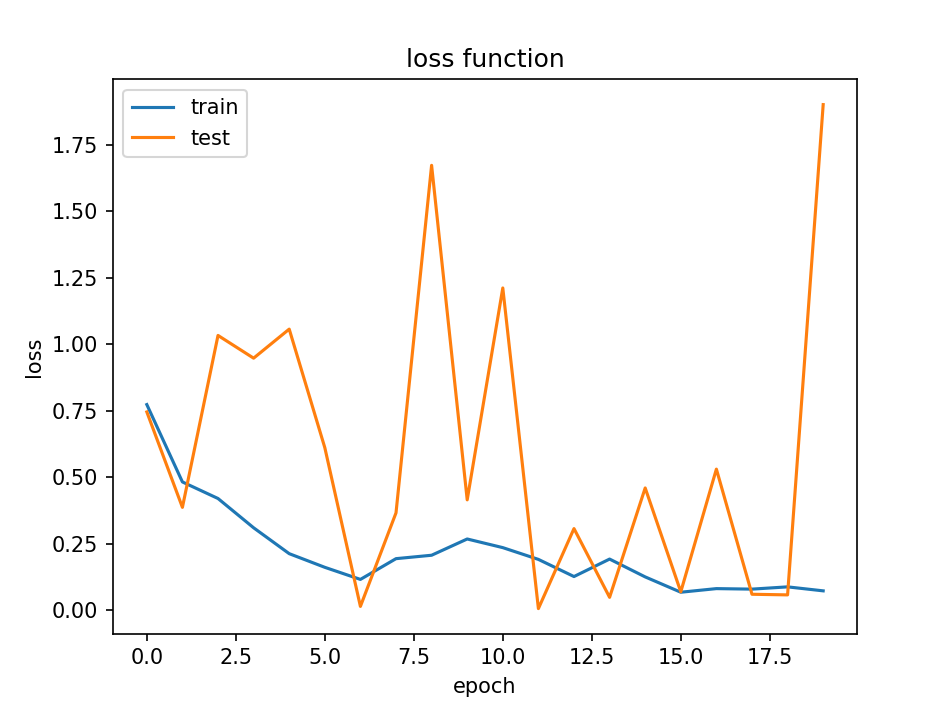

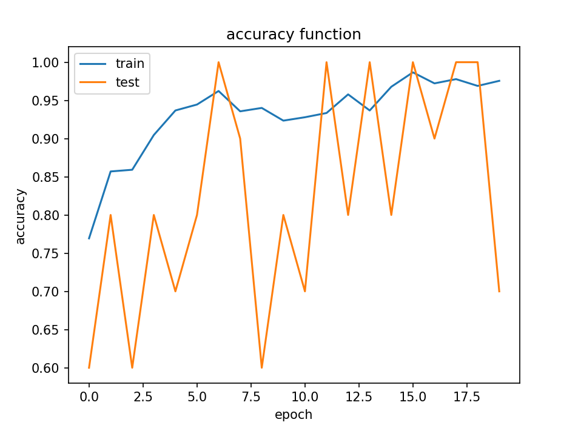

> 卷积网络 + SGD

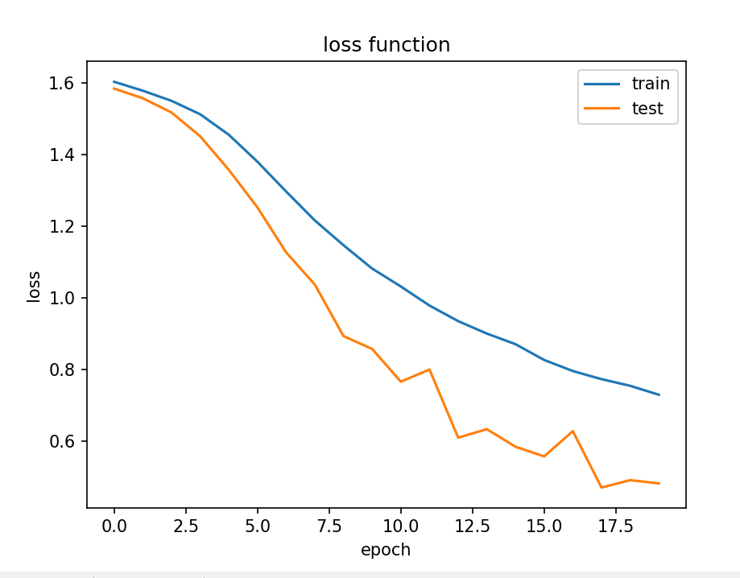

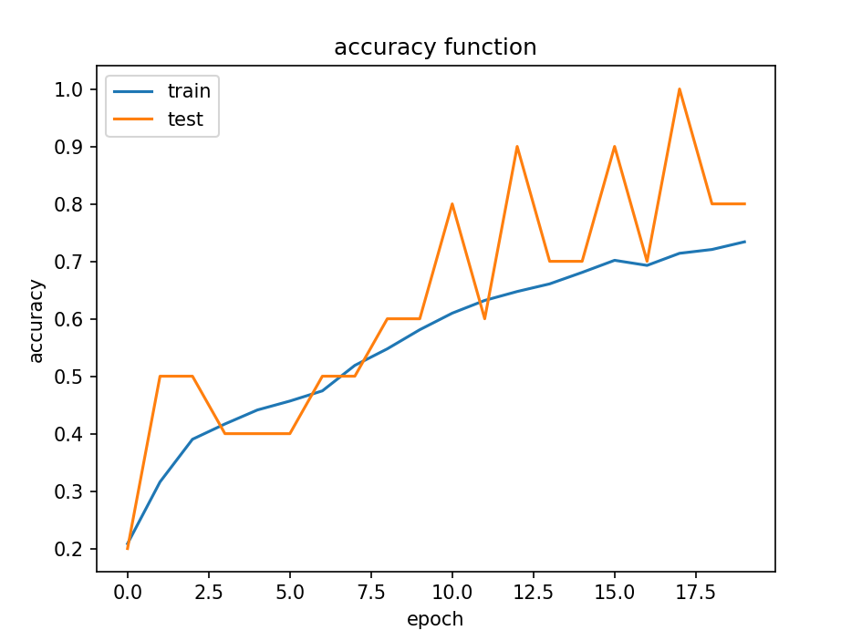

结合上述图像，不难发现测试集准确率波动很大且很频繁，使得结论不太稳定。

总体分析，(`Reanet18` + SGD) > (卷积 + Adam) > (卷积 + SGD) > (`Resnet18` + Adam)

但这只是基于上述层数设计的卷积网络，可能还具有很大的优化空间。如果继续优化网络结构，卷积的性能可能进一步提升。

### 四，思考题

此次实验没有思考题

### 五，参考资料

1. 2.CSDN
