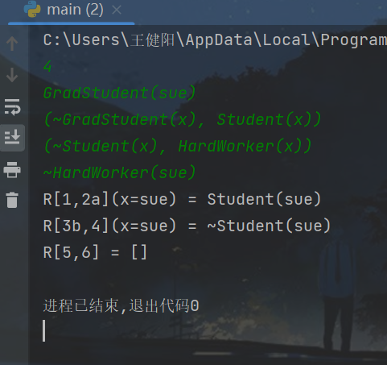

# 中山大学计算机学院

## 人工智能实验报告

课程名称：Artificial Intelligence

| 教学班级 | 超算班      | 专业  | 信息与计算科学 |
| ---- | --------:| --- | ------- |
| 学号   | 21307261 | 姓名  | 王健阳     |

### 一，实验题目

    实现一阶逻辑归结算法

### 二，实验内容

#### 算法原理

        对于一个已经完成规范化的子句集，不断地从中取出两个子句进行归结，并将归结后的新子句加入到子句集中。一直重复此操作，直到子句集中出现空子句，则说明证明成功。

        对于单次的归结操作，每次都尝试是否能够找到一种变量替换的方式，使得替换过后的子句可以被归结。变量替换可以不唯一，但这里一致采用最一般合一的替换：输入两个具有相同谓词的原子公式（它们此前应该已经被判定是可以被合一的），最一般赋值集合初始化为空。依次比对它们的个体并列出差异集。从差异集中取出其中一个不匹配项（一般是一个为常量一个为变量），令其作为替换并合并到赋值集合中。直到不匹配项完全被消除

#### 伪代码

```
while not Has_NIL(clause_set) begin
    # 每次采取暴力二重循环的方式进行归结
    vat i = 0
    while i < len(clause_set) begin
        var j = i + 1
        while j < len(clause_set) begin
            # 对于暴力枚举出来的每一个子句组合，先判断能否归结，在进行归结（防止出现太多的无用子句）
            if i != j and AbleToGJ(clause_set[i], clause_set[j]):
                new_clause = GJ(clause_set[i], clause_set[j])
                # 将新子句加入到集合中
                clause_set.append(new_clause)
            j += 1
        end
        i += 1
    end
end


procedure AbleToGJ(clause1, clause2) begin
    for literal1 in clause1 begin
        for literal2 in clause2 begin
            # 首先看是否有匹配的谓词
            if literal1.predicate == literal2.predicate
                # 再看个体列表是否满足条件
                if compare(literal1.individual_list, literal2.individual_list)
                    return true
        end
    end
    # 遍历完毕没找到，故不可归结
    return false
end


procedure GJ(clause1, clause2) begin
    # 初始化归结后子句的文字列表
    var new_literal_list
    # 通过MGU生成最一般合一替换, 传入被标记的位置
    var substi = MGU(clause1.marked, clause2.marked)
    # 对两个子句进行替换合一，最后生成新子句并返回
    clause1 = Substitute(clause1, substi)
    clause2 = Substitute(clause2, substi)
    new_literal_list.extend(clause1.literal_list)
    new_literal_list.extend(clause2.literal_list)
    new_literal_list.remove(clause1.literal_list[c1.mark_index])
    new_literal_list.remove(clause2.literal_list[c2.mark_index])
    return Clause(new_literal_list)
end


procedure MGU(ind1: list, ind2: list) begin
    # 初始化为空替换
    var substi
    # 当传入的两个个体列表已经相等时，不需要替换即可直接归结
    while ind1 != ind2 begin
        for ii in range(len(ind1)):
            # 在个体列表的对应位置找到第一个不匹配项，并确保其是一个变量一个常量
            # 在优化后的IsVariable函数中可以判断函数个体
            if ind1[ii] != ind2[ii] and IsVariable(ind1[ii]) ^ IsVariable(ind2[ii])
                if IsVariable(ind1[ii])
                    tt = [ind2[ii] + '/' + ind1[ii]]
                else
                    tt = [ind1[ii] + '/' + ind2[ii]]
                # 依次对两个个体列表进行变量替换
                Substitution(tt).substitute(ind1)
                Substitution(tt).substitute(ind2)
                # 进行替换的复合
                substi.recombination(Substitution(tt))
                break
    end
    return substi
end
```

#### 关键代码展示

进行归结的全过程 (一些定义类在sources.py里)

> 主函数部分

```python
while not Has_NIL(clause_set):
    # 每次采取暴力二重循环的方式进行归结
    lst = []
    i, cnt = 0, 0
    while i < len(clause_set):
        j = i + 1
        while j < len(clause_set):
            # 对于暴力枚举出来的每一个子句组合，先判断能否归结，在进行归结（防止出现太多的无用子句）
            if i != j and AbleToGJ(clause_set[i], clause_set[j]):
                new_clause = GJ(clause_set[i], clause_set[j])
                # 记录新子句是来自哪两个子句
                new_clause.father, new_clause.mother = i, j
                # 记录新子句本身在插入到子句集之后的索引
                new_clause.own = len(clause_set) + cnt
                cnt += 1
                # 对于归结出的新子句，如果立马加入到子句集中，会引起死循环（不知道为啥）
                # 故先将一轮二重循环的结果全部存储到临时子句集中，最后在一起压进子句集中
                lst.append(new_clause)
                pass
            j += 1
        i += 1
    # 一次二重遍历结束，将临时集压进子句集中
    clause_set.extend(lst)
```

> 子函数部分

```python
def AbleToGJ(clause1: Clause, clause2: Clause):
    for index1 in range(clause1.length()):
        for index2 in range(clause2.length()):
            # 二重循环遍历所有可能的谓词组合，如果不存在互补谓词，在二重循环结束之后返回false
            pred1, pred2 = clause1.getPredicate(index1), clause2.getPredicate(index2)
            if pred1 == Opposite(pred2):
                # 谓词符合条件，接下来比对谓词列表
                ind1_list, ind2_list = clause1.getIndividualList(index1), clause2.getIndividualList(index2)
                # 完全相同，直接赋值记录匹配谓词的索引，返回True
                if ind1_list == ind2_list:
                    clause1.mark_index, clause2.mark_index = index1, index2
                    return True
                # 以下都是必不完全相同的个体列表（一定会存在不匹配项）
                for ii in range(len(ind1_list)):
                    # 找到第一个不匹配项
                    if ind1_list[ii] != ind2_list[ii]:
                        # 此处为了简化流程，对于对应位置为不同变量的情形给予了false（有时间的话可以从此处着手优化）
                        # 两个都是常量，无法替换，直接返回false
                        if not IsVariable(ind1_list[ii]) and not IsVariable(ind2_list[ii]):
                            return False
                        # 一个常量一个变量，初步符合条件
                        if IsVariable(ind1_list[ii]) ^ IsVariable(ind2_list[ii]):
                            # 遍历其后续的个体组合，若相应位置上仍存在不同且都是常量的情况，返回false
                            for jj in range(ii + 1, len(ind1_list)):
                                if ind1_list[jj] != ind2_list[jj] and not IsVariable(ind1_list[jj]) and not IsVariable(ind2_list[jj]):
                                    return False
                            # 反之则认为符合归结条件，赋值记录匹配的公式索引，返回True
                            clause1.mark_index, clause2.mark_index = index1, index2
                            return True
    # 无互补谓词组合，返回false
    return False
```

```python
def MGU(ind1: list, ind2: list):
    # 初始化为空替换
    substi = Substitution([])
    # 当传入的两个个体列表已经相等时，不需要替换即可直接归结
    while ind1 != ind2:
        for ii in range(len(ind1)):
            # 在个体列表的对应位置找到第一个不匹配项，并确保其是一个变量一个常量
            # 在优化后的IsVariable函数中可以判断函数个体
            if ind1[ii] != ind2[ii] and IsVariable(ind1[ii]) ^ IsVariable(ind2[ii]):
                if IsVariable(ind1[ii]):
                    tt = [ind2[ii] + '/' + ind1[ii]]
                else:
                    tt = [ind1[ii] + '/' + ind2[ii]]
                # 依次对两个个体列表进行变量替换
                Substitution(tt).substitute(ind1)
                Substitution(tt).substitute(ind2)
                # 最后调用现成的复合函数
                substi.recombination(Substitution(tt))
                break
        # while end
    return substi
```

```python
def Substitute(clause: Clause, substi: Substitution):
    for index in range(clause.length()):
        # 对于子句中的每个文字而言，只要有一个个体在替换的changelist中，就对该文字进行整体替换
        for individual in clause.getIndividualList(index):
            if individual in substi.from_list:
                tt = substi.from_list.index(individual)
                literal = clause.literal_list[index]
                # 对原子公式进行字符串替换（如果被替换对象在谓词中存在，会出现bug，故仅在谓词区域进行替换，最后再拼接回去）
                s1 = literal[literal.index('('):].replace(individual, substi.to_list[tt])

                clause.literal_list[index] = literal[:literal.index('(')] + s1
    return clause
```

```python
def GJ(clause1: Clause, clause2: Clause):
    # 初始化归结后子句的文字列表
    new_literal_list = []
    # 通过MGU生成最一般合一替换
    substi = MGU(clause1.getIndividualList(clause1.mark_index), clause2.getIndividualList(clause2.mark_index))
    # 对两个子句进行深拷贝，在进行替换合一，最后生成新子句并返回
    c1, c2 = copy.deepcopy(clause1), copy.deepcopy(clause2)
    c1, c2 = Substitute(c1, substi), Substitute(c2, substi)
    new_literal_list.extend(c1.literal_list)
    new_literal_list.extend(c2.literal_list)
    new_literal_list.remove(c1.literal_list[c1.mark_index])
    new_literal_list.remove(c2.literal_list[c2.mark_index])
    # 在最后进行一次set()调用，确保新子句集里面不会有相同的谓词
    return Clause(list(set(new_literal_list)), substi)
```

#### 创新点 & 优化

        由于这次的测试用例给出的公式较为特殊，当然也有时间的因素，故在初期设计算法的时候只考虑了特殊情形，即算法对于输入子句集的要求较为苛刻。但在成功通过三个测试用例之后，我对其进行了适当的优化，使得我的程序在能够处理三个测试用例的同时，当谓词公式的变量是嵌套函数的时候，也可以给出正确的结果（但是常量不能也带函数，不然替换输出那里会有错误，这一点还没有优化）

        涉及到的部分优化代码如下：

```python
# 改进之后的初始化函数，可以处理原子公式内带函数括号的个体
def DataProcessing_opt(clause_set_str: list):
    clause_set = []
    global original_set, num
    for clause_str in clause_set_str:
        num = len(clause_set_str)
        clause = Clause([])
        clause_str = clause_str[1:-1] if clause_str[0] == '(' else clause_str
        stack1, stack2 = Stack(), Stack()
        literal = ''
        # ~A(f(x)), S(f(x)), C(f(x))
        # 设置两个栈来检测原子公式的末尾
        for ch in clause_str:
            literal += ch
            if ch == '(':
                stack1.push(ch)
                stack2.push(ch)
            if ch == ')':
                stack1.pop()
            if stack1.empty() and not stack2.empty():
                literal = literal[2:] if literal[0] == ',' else literal
                clause.literal_list.append(literal)
                stack2.clear()
                literal = ''
        clause_set.append(clause)
        original_set = copy.deepcopy(clause_set)
    return clause_set
```

```python
def IsVariable(individual: str):
    # 以下的while循环是优化内容
    while '(' in individual:
        individual = individual[individual.index('(') + 1: -1]
    return individual in ['x', 'y', 'z', 'u', 'v', 'w']
```

### 三，实验结果及分析

##### 算法结果展示实例

调用Initial() 函数，在sources.py复制测试用例，即可依次得到以下三个结果

```python
clause_set = Initial()
# clause_set = DataProcessing_opt(test4)
'''
for ii in range(len(clause_set)):
    print(str(ii + 1) if ii >= 9 else '0' + str(ii + 1), clause_set[ii].literal_list)
print('----------------------')
'''
# 开始处理，当子句集中开始存在空子句的时候停止循环，完成整个证明过程
while not Has_NIL(clause_set):
    # 每次采取暴力二重循环的方式进行归结
    lst = []
    i, cnt = 0, 0
    while i < len(clause_set):
        j = i + 1
        while j < len(clause_set):
            # 对于暴力枚举出来的每一个子句组合，先判断能否归结，在进行归结（防止出现太多的无用子句）
            if i != j and AbleToGJ(clause_set[i], clause_set[j]):
                new_clause = GJ(clause_set[i], clause_set[j])
                # 记录新子句是来自哪两个子句
                new_clause.father, new_clause.mother = i, j
                # 记录新子句本身在插入到子句集之后的索引
                new_clause.own = len(clause_set) + cnt
                cnt += 1
                # 对于归结出的新子句，如果立马加入到子句集中，会引起死循环（不知道为啥）
                # 故先将一轮二重循环的结果全部存储到临时子句集中，最后在一起压进子句集中
                lst.append(new_clause)
                pass
            j += 1
        i += 1
    # 一次二重遍历结束，将临时集压进子句集中
    clause_set.extend(lst)
# 对已经出现空子句的子句集进行规范化处理以及规范输出
Regulate(clause_set)
```

三个测试用例的输出如下：




 


##### 评测指标展示及分析

        此次实验所设计算法，碍于没有有效的判断措施，使得时间复杂度较大。设有m个子句每个子句平均有n个原子公式（为简化全假设为单参数），则至少为O（m<sup>2</sup> \* n<sup>2</sup>）。对此进行的适当优化就是引入了归结判断函数，在简化了算法设计的同时，也适当减少了调用归结函数的次数，略微加快了程序的运行时间。但是即便如此，子句集内的数据还是会以一个很恐怖的速度增长。对此的一个优化便是在二重内层循环中，令j = i + 1而不是0。对于用例3，这一改动是十分明显的。后者会有四千多项，而前者只会有三百个子句左右

### 四，思考题

此次实验没有思考题

```python

```

### 五，参考资料

1.实验归结原理pdf

2.CSDN
