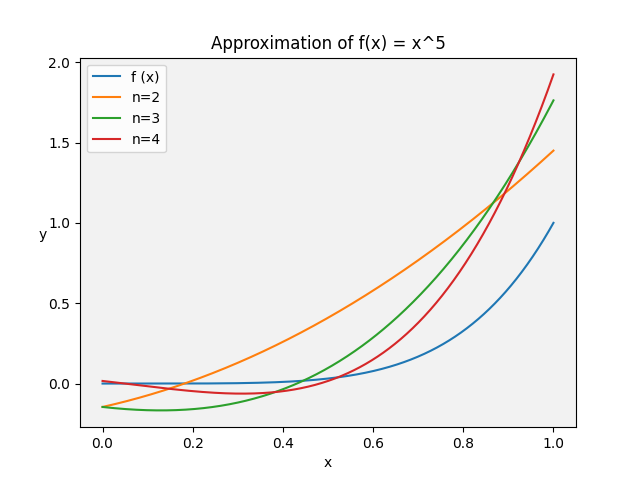
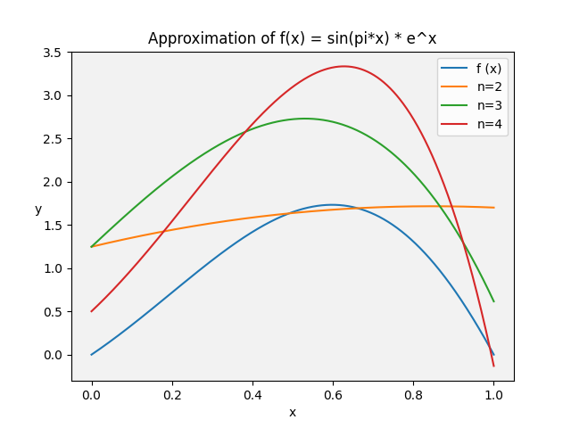
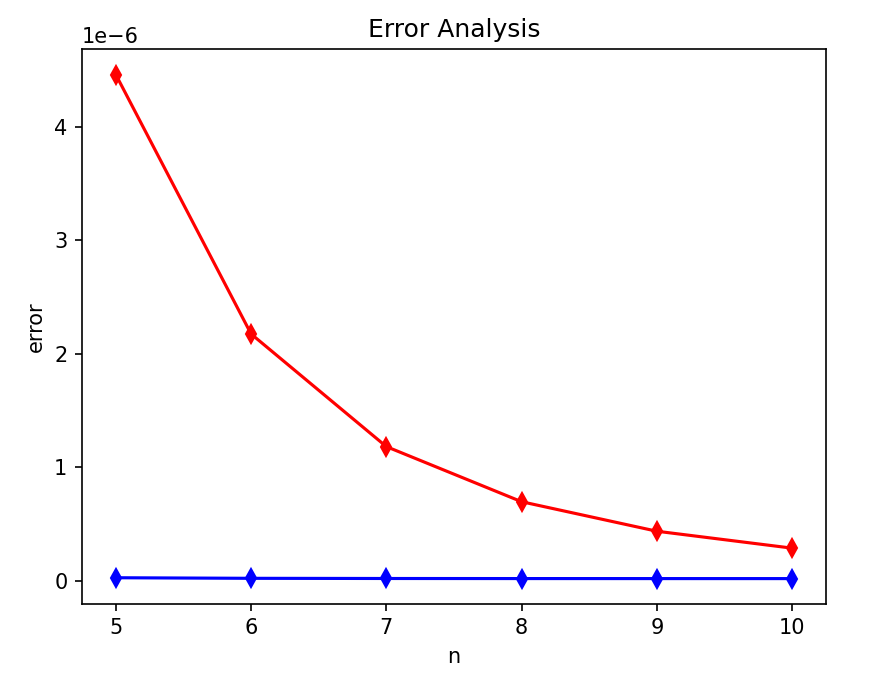
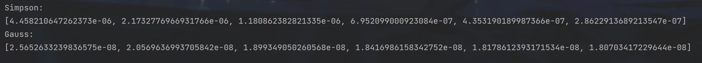
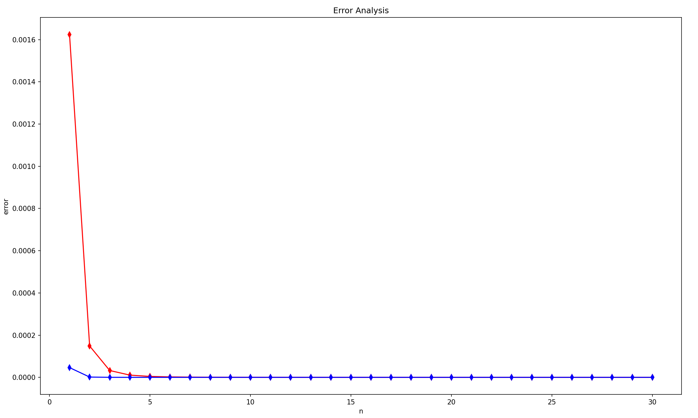
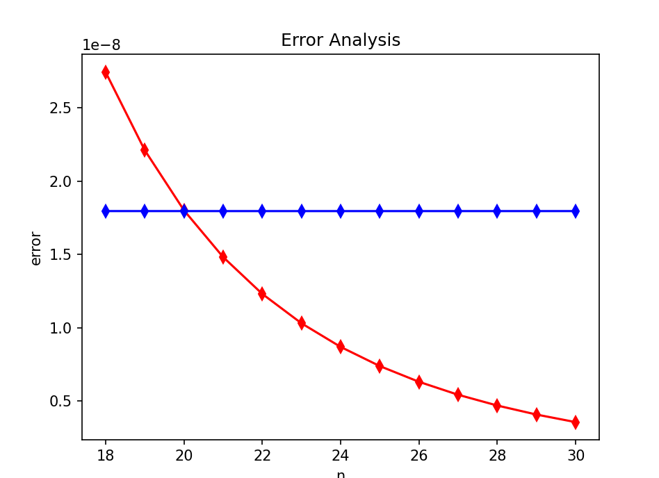
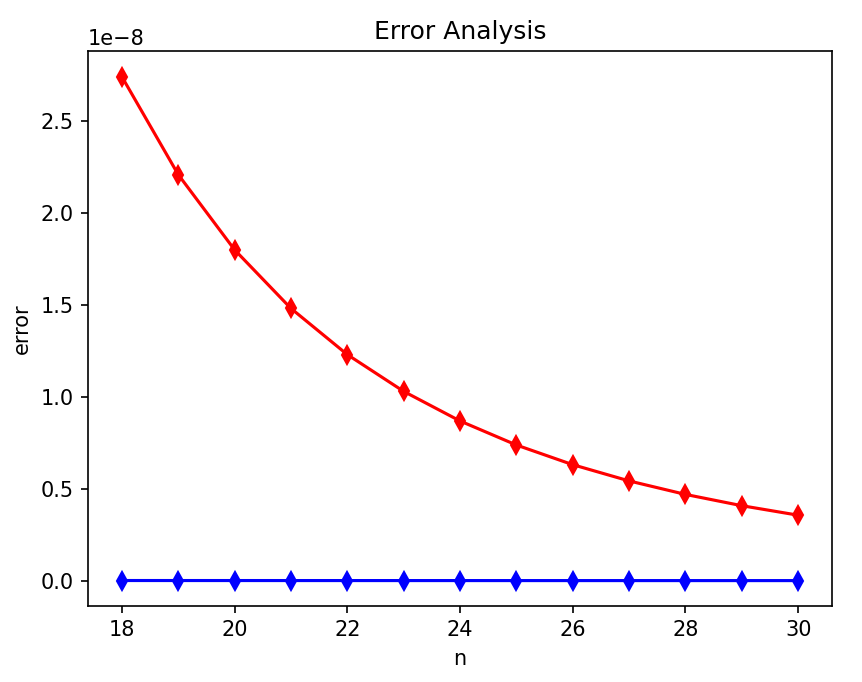
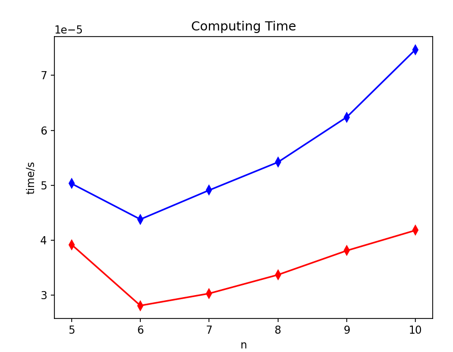
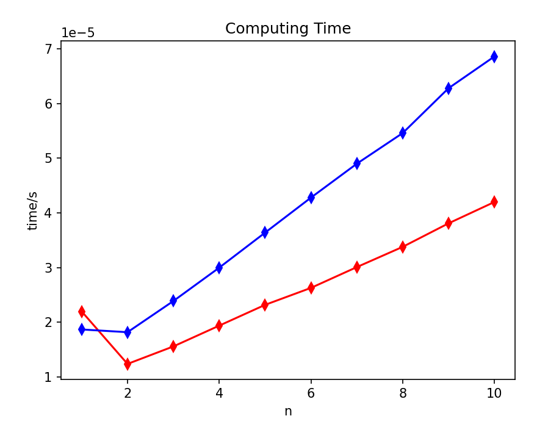
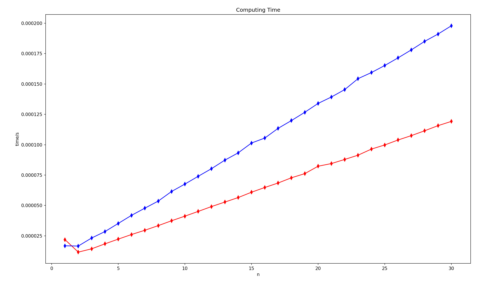

# 中山大学本科生数值分析大作业

| 小组成员        | 指导老师 | 选题       |
|:-----------:|:----:|:--------:|
| 熊文啸 王建阳 陈孝文 | 汪涛   | A6 B6 C4 |

## T1(A.6) 函数逼近

利用 $Chebyshev$ 多项式，构造下列函数 $f(x)$ 在区间 $[0,1]$ 上的 $n$次**最佳平方逼近多项式** $p_{n}^{*}(x)$，并同时画出 $p_{n}^{*}(x)$ 与 $f(x)$ 的函数曲线进行比较

(a) $f(x)=x^5,\quad n=2,3,4.$

(b) $f(x)=\sin(\pi x)\cdot e^{x},\quad n=2,3,4.$

注：在区间 $[-1, 1]$ 上权函数 $\rho(x)\equiv\frac{1}{\sqrt{1-x^2}}$

### 关键代码

> T1.py

```python
import numpy as np
import matplotlib.pyplot as plt
from scipy import integrate as igt


# 用递推的方法定义切比雪夫多项式函数
def cheb_poly(n):
    if n == 0:
        return lambda x: 1.0
    elif n == 1:
        return lambda x: x
    else:
        return lambda x: 2 * x * cheb_poly(n - 1)(x) - cheb_poly(n - 2)(x)


# 内积的算法
def inner_product(f, g):
    a = lambda x: f(x) * g(x) * rho(x)
    result, error = igt.quad(a, 0, 1)
    return result


# 计算最佳平方逼近多项式
def best_approximation(f, n):
    coefficients = np.zeros(n + 1)  # 存储系数 (a0,a1,...,an)
    approx = np.zeros_like(x)  # 存储逼近多项式计算后的y值

    for i in range(n + 1):
        # 计算系数，并把系数×多项式加到y值里面
        coefficients[i] = inner_product(f, cheb_poly(i)) / \
                        inner_product(cheb_poly(i), cheb_poly(i))
        approx += coefficients[i] * cheb_poly(i)(x)

    return approx


# 构造最佳平方逼近多项式
n_values = [2, 3, 4]
# 两个函数以及权函数
f1 = lambda x: x**5
f2 = lambda x: np.sin(np.pi * x) * np.exp(x)
rho = lambda x: 1 / np.sqrt(1 - x**2)

x = np.linspace(0, 1, 1000)  # 在区间 [0, 1] 上取样点

bg_color = (0.92, 0.92, 0.92)

# (a) Approximation of f(x) = x^5
plt.figure()
plt.plot(x, f1(x), label="f (x)")
for n in n_values:
    approx = best_approximation(f1, n)
    plt.plot(x, approx, label=f"n={n}")
plt.gca().set_facecolor(bg_color)
plt.xlabel("x")
plt.ylabel("y", rotation="horizontal")
plt.legend()
plt.title("Approximation of f(x) = x^5")
plt.show()

# (b) Approximation of f(x) = sin(pi*x) * e^x
plt.figure()
plt.plot(x, f2(x), label="f (x)")
for n in n_values:
    approx = best_approximation(f2, n)
    plt.plot(x, approx, label=f"n={n}")
plt.gca().set_facecolor(bg_color)
plt.xlabel("x")
plt.ylabel("y", rotation="horizontal")
plt.legend()
plt.title("Approximation of f(x) = sin(pi*x) * e^x")
plt.show()
```

### 结果分析

下图为$f(x)=x^5$的 $p_{n}^{*}(x)，n=2,3,4$ 与 $f(x)$ 的函数曲线比较，可见n越大时拟合的相对越好



下图为$f(x)=\sin(\pi x)\cdot e^{x}$的 $p_{n}^{*}(x)，n=2,3,4$ 与 $f(x)$ 的函数曲线比较，可见n越大时拟合的相对越好



---------------------

-------------------

## T2(B.6) 数值积分

分别用下列方法，计算积分$I=\int_0^1\frac{xe^x}{(1+x)^2}dx$，

(a) 当$n$分别为 $5,6,...,10$ 时，请将积分区间等分成$n$个小区间，利用**复化的** $Simpson$ 公式计算$I$的数值积分；

(b) 当$n$分别为 $5,6,...,10$ 时，请将积分区间等分成$n$个小区间，利用**复化的**两个求积节点的 $Legendre-Gauss$ 公式计算$I$的数值积分；

(c) 利用 matlab 函数 `integral()` 或 `python-scipy-integrate` 模块提供的 `quad()` 函数等现有类似工具，计算出高精度的数值积分。

(d) 以$n$为横轴坐标，将(a)与(b)中所得的数值积分结果和(c)中的高精度值画在一张平面图里，并以此进行观察分析。

> 说明

高斯-勒让德求积公式仅适用于$[-1, 1]$上的积分，故对任意$[a,b]$上的积分需要换元：

$\qquad \qquad x \in [a, b] \qquad \rightarrow \qquad t \in [-1, 1]$

$\qquad \qquad t = \frac{2}{b-a}x - \frac{a+b}{a-b} \qquad \quad x = \frac{a-b}{2}t + \frac{a + b}{2}$

$设g(t) = \frac{a-b}{2}f(\frac{a-b}{2}t+\frac{a+b}{2})，则有：$

$\qquad \qquad \int_a^b f(x)dx \;= \; \int_{-1}^1g(t)dt$

### 关键代码

> numerical_integration.py

```python
import math


class Gauss:
    # number of nodes can't be more than 5
    legendre_table = [
        [[0.0], [2.0]],
        [[-0.5773503, 0.5773503], [1.0, 1.0]],
        [[-0.7745967, 0.0, 0.7745967], [0.5555556, 0.8888889, 0.5555556]],
        [[-0.8611363, -0.3399810, 0.3399810, 0.8611363], [0.3478548, 0.6521452, 0.6521452, 0.3478548]],
        [[-0.9061798, -0.5384693, 0.0, 0.5384693, 0.9061798], [0.2369269, 0.4786287, 0.5688889, 0.4786287, 0.2369269]],
        [[-0.9324695, -0.6612904, -0.2386192, 0.2386192, 0.6612094, 0.9324695], [0.1713245, 0.3607616, 0.4679139, 0.4679139, 0.3607616, 0.1713245]]
    ]

    # default integrating interval is [-1, 1]
    def Legendre(self, func, n):
        goal_data = self.legendre_table[n]
        _xs, _as = [], []
        for i in range(n + 1):
            _xs.append(goal_data[0][i])
            _as.append(goal_data[1][i])

        result = 0.0
        for i in range(n + 1):
            result += _as[i] * func(_xs[i])
        return result


class Composite:
    @staticmethod
    def Simpson(func, a, b, n):
        # get each sub_interval
        _xs = [(a + (b - a) * (k / n)) for k in range(n + 1)]
        result = 0.0
        for i in range(n):
            # [_xs[i], _xs[i + 1]]
            ta, tb = _xs[i], _xs[i + 1]
            result += ((tb - ta)/6) * (func(ta) + 4 * func((ta + tb)/2) + func(tb))
        return result

    @staticmethod
    def Gauss(func, a, b, n, gn):
        # n: number of composite interval
        # gn: number of Gauss numerical integration nodes
        # initialize a Gauss object
        gauss = Gauss()
        result = 0.0
        boundary_points = [(a + (b - a) * (k / n)) for k in range(n + 1)]
        for i in range(n):
            ta, tb = boundary_points[i], boundary_points[i + 1]

            # convert each sub_interval [a, b] into [-1, 1]
            # define t = (2 / (b - a)) * x - (b + a) / (b - a)
            # x = (b - a) / 2 * t + (a + b) / 2, dx = (b - a) / 2 * dt
            def g(xs):
                return ((tb - ta) / 2) * func(((tb - ta) / 2) * xs + (ta + tb) / 2)
            result += gauss.Legendre(g, gn)
        return result
```

> T2.py

```python
import numerical_integration as ni
import matplotlib.pyplot as plt
import scipy.integrate as si
import numpy as np
import time
import math


def f(xs):
    return (xs * np.exp(xs)) / ((xs + 1) ** 2)


if __name__ == '__main__':
    # initialize n_list, such as from 5 to 10
    n_list = np.arange(5, 11, 1)
    Simpson_error_list = []
    Gauss_error_list = []

    Simpson_time_cost = []
    Gauss_time_cost = []
    # calculate accurate result
    res = si.quad(f, 0, 1)[0]

    # sti and edi are used as a timer
    # for each n, calculate and record its Simpson result and Gauss result
    for n in n_list:
        st1 = time.perf_counter()
        result1 = ni.Composite.Simpson(f, 0, 1, n)
        ed1 = time.perf_counter()
        Simpson_time_cost.append(ed1 - st1)

        st2 = time.perf_counter()
        result2 = ni.Composite.Gauss(f, 0, 1, n, 2)
        ed2 = time.perf_counter()
        Gauss_time_cost.append(ed2 - st2)

        # record errors 
        Simpson_error_list.append(math.fabs(result1 - res))
        Gauss_error_list.append(math.fabs(result2 - res))

    plt.title('Error Analysis')
    plt.xlabel('n')
    plt.ylabel('error')
    plt.plot(n_list, Simpson_error_list, 'r-d')
    plt.plot(n_list, Gauss_error_list, 'b-d')
    plt.show()

    plt.title('Computing Time')
    plt.xlabel('n')
    plt.ylabel('time/s')
    plt.plot(n_list, Simpson_time_cost, 'r-d')
    plt.plot(n_list, Gauss_time_cost, 'b-d')
    plt.show()
```

### 结果分析

##### 结果精度

> $n=5,\dots,10$的误差图像如下





        可以看出，复合高斯求积公式在n较小的时候就拥有极小的误差，几乎稳定在$10^{-8}$量级，而复合辛普森公式则会随着n的增大迅速收敛。

> 一些拓展

当n继续增大时：



局部放大如下：



        可以看出，高斯积分的收敛性与n的取值几乎没有关系。对于题中的函数，$n < 20$时，复合高斯积分比复合辛普森积分要更精确，但随着n的不断增大，复合辛普森公式始终逐步收敛，并在$n > 20$的时候实现了精度反超。但由于此时的误差早已达到了$10^{-8}$量级，故也没必要在精确下去了（绝大多数情况下）

题目里要求的高斯求积默认只有两个节点，若在此时将节点数改为三个：



        可以看出高斯积分的精度再次大幅提高，但仍旧与n没有关系。故高斯积分的精度主要取决于求积节点个数，而跟区间个数几乎无关，在$n \ge 5$的时候就趋于稳定了。

##### 计算耗时

这里采用`time`模块的`perf_counter`函数用以计时。

> 说明

        无论n取什么区间，红蓝线在n的前两个值之间都是呈下降趋势。可能是由于某种未知问题导致的。故一般忽略掉第一段递减的时间线。

> $n=5,\dots ,10$的耗时





当n继续增大时：



（这是扰动相对最小的一次）

        结合两图，可以看出$n=5,\dots ,10$的时候，两种复合求积公式耗时大体上呈线性递增，并且此时是复合高斯积分耗时一直多于复合辛普森公式。

--------------

-------------------------

## T3(C.4) 线性方程

分别用 $Gauss$消去法、$Gauss$列主元消去法、$Cholesky$分解法，计算下列线性方程组的解。
$
\begin{bmatrix}10&1&2&3&4\\ 1&9&-1&2&-3\\ 2&-1&7&3&-5\\ 3&2&3&12&-1\\ 4&-3&-5&-1&15\end{bmatrix}\begin{bmatrix}x_1\\ x_2\\ x_3\\ x_4\\ x_5\end{bmatrix}=\begin{bmatrix}12\\ -27\\ 14\\ -17\\ 12\end{bmatrix}
$

### 关键代码

> gauss.py、gauss_col。py、cholesky。py

```gauss.py
import numpy as np
import time

def gauss_elimination(A, B):
    n = len(B)
    AB = np.column_stack((A, B))  # 形成增广矩阵

    for i in range(n):
        # 部分主元选取
        max_row = i
        for j in range(i + 1, n):
            if abs(AB[j, i]) > abs(AB[max_row, i]):     # 选绝对值最大的作为主元
                max_row = j
        AB[[i, max_row]] = AB[[max_row, i]]  # 交换行

        # 前向消元
        for j in range(i + 1, n):
            factor = AB[j, i] / AB[i, i]
            AB[j] -= factor * AB[i]     # 让每一列主元下的元素为0

    # 回代求解(逆序)
    x = np.zeros(n)
    for i in range(n - 1, -1, -1):
        x[i] = AB[i, n]  # 式子左边等于右边
        for j in range(i + 1, n):
            x[i] -= AB[i, j] * x[j]  # 减去已知解的部分
        x[i] /= AB[i, i]  # 除以系数得到答案

    return x

def compute_numerical_error(A, B, x):
    # 计算验证向量 y
    y = np.dot(A, x) - B

    # 计算验证向量 y 的范数
    error = np.linalg.norm(y)

    return error

if __name__ == "__main__":
    r_num = 100
    total_time = 0
    A = np.array([[10.0, 1.0, 2.0, 3.0, 4.0],
                [1.0, 9.0, -1.0, 2.0, -3.0],
                [2.0, -1.0, 7.0, 3.0, -5.0],
                [3.0, 2.0, 3.0, 12.0, -1.0],
                [4.0, -3.0, -5.0, -1.0, 15.0]])

    B = np.array([12.0, -27.0, 14.0, -17.0, 12.0])
    errors = []
    for _ in range(r_num):
        start_time = time.time()
        x = gauss_elimination(A, B)
        end_time = time.time()
        total_time += end_time - start_time
        error = compute_numerical_error(A, B, x)
        errors.append(error)
    average_time = total_time / r_num
    average_error = np.mean(errors)
    print("方程组的解：", x)
    print("共耗费了：%fs" %average_time)
    print("数值误差评估结果：", average_error)
```

```gauss_col.py
import numpy as np
import time
def gauss_elimination(A, B):
    n = len(B)  # 获取向量B的长度，即线性方程组的维度
    AB = np.column_stack((A, B))  # 将矩阵A和向量B按列合并，形成增广矩阵AB

    # 前向消元
    for i in range(n):
        # 主元选取
        max_row = i  # 假设当前行为最大主元所在的行
        for j in range(i + 1, n):
            if abs(AB[j, i]) > abs(AB[max_row, i]):
                max_row = j  # 更新最大主元所在的行
        AB[[i, max_row]] = AB[[max_row, i]]  # 交换行，将最大主元所在行移动到当前行

        # 消元
        for j in range(i + 1, n):
            factor = AB[j, i] / AB[i, i]  # 计算消元的倍乘因子
            for k in range(i, n + 1):
                AB[j, k] -= factor * AB[i, k]  # 将当前行的倍乘因子倍乘后加到下一行，实现消元操作

    # 回代求解(逆序)
    x = np.zeros(n)  # 创建一个与维度n相同的零向量x，用于存储解
    for i in range(n - 1, -1, -1):
        x[i] = AB[i, n]  # 将增广矩阵AB的最后一列元素赋值给x的第i个元素，作为初始值
        for j in range(i + 1, n):
            x[i] -= AB[i, j] * x[j]  # 用已知的解部分计算x的第i个元素
        x[i] /= AB[i, i]  # 将计算得到的x的第i个元素除以AB的第i行第i列的元素，得到最终的解

    return x


def compute_numerical_error(A, B, x):
    # 计算验证向量 y
    y = np.dot(A, x) - B

    # 计算验证向量 y 的范数
    error = np.linalg.norm(y)

    return error

if __name__ == "__main__":
    r_num = 100
    total_time = 0
    A = np.array([[10.0, 1.0, 2.0, 3.0, 4.0],
              [1.0, 9.0, -1.0, 2.0, -3.0],
              [2.0, -1.0, 7.0, 3.0, -5.0],
              [3.0, 2.0, 3.0, 12.0, -1.0],
              [4.0, -3.0, -5.0, -1.0, 15.0]])

    B = np.array([12.0, -27.0, 14.0, -17.0, 12.0])
    errors = []
    for _ in range(r_num):
        start_time = time.time()
        x = gauss_elimination(A, B)
        end_time = time.time()
        total_time += end_time - start_time
        error = compute_numerical_error(A, B, x)
        errors.append(error)
    average_time = total_time / r_num
    average_error = np.mean(errors)
    print("方程组的解：", x)
    print("共耗费了%fs" %average_time)
    print("数值误差评估结果：", average_error)
```

```cholesky.py
import numpy as np
import time

def backward_substitution(U, y):
    n = U.shape[0]  # 获取矩阵U的维度
    x = np.zeros(n)  # 创建一个与U的维度相同的零向量x

    for i in range(n-1, -1, -1):
        x[i] = y[i]  # 将y的第i个元素赋值给x的第i个元素
        for j in range(i+1, n):
            x[i] -= U[i, j] * x[j]  # 用已知的x的元素计算x的第i个元素
        x[i] /= U[i, i]  # 将计算得到的x的第i个元素除以U的第i行第i列的元素

    return x


def forward_substitution(L, B):
    n = L.shape[0]  # 获取矩阵L的维度
    y = np.zeros(n)  # 创建一个与L的维度相同的零向量y

    for i in range(n):
        y[i] = B[i]  # 将B的第i个元素赋值给y的第i个元素，作为初始值
        for j in range(i):
            y[i] -= L[i, j] * y[j]  # 用已知的y的元素计算y的第i个元素
        y[i] /= L[i, i]  # 将计算得到的y的第i个元素除以L的第i行第i列的元素

    return y

def compute_numerical_error(A, B, x):
    # 计算验证向量 y
    y = np.dot(A, x) - B

    # 计算验证向量 y 的范数
    error = np.linalg.norm(y)

    return error


# 将正定矩阵化为下三角矩阵
def cholesky_decomposition(A):
    n = A.shape[0]  # 获取矩阵A的维度
    L = np.zeros_like(A)  # 创建一个与A形状相同的零矩阵L

    for i in range(n):
        for j in range(i+1):
            if i == j:
                sum_sq = np.sum(L[i, :j]**2)
                # 计算已经计算过的对角线元素的平方和
                # ∑(L[i, k]^2), k=1 to j-1
                L[i, j] = np.sqrt(A[i, i] - sum_sq)
                # 计算L的第i行第j列元素的值
                # L[i, j] = √(A[i, i] - ∑(L[i, k]^2), k=1 to j-1)
            else:
                sum_prod = np.sum(L[i, :j] * L[j, :j])
                # 计算乘积之和
                # ∑(L[i, k] * L[j, k]), k=1 to j-1
                L[i, j] = (A[i, j] - sum_prod) / L[j, j]
                # 计算L的第i行第j列元素的值
                # L[i, j] = (A[i, j] - ∑(L[i, k] * L[j, k]), k=1 to j-1) / L[j, j]

    return L


if __name__ == "__main__":
    r_num = 100
    total_time = 0
    # 构建系数矩阵和右侧常数向量
    A = np.array([[10.0, 1.0, 2.0, 3.0, 4.0],
              [1.0, 9.0, -1.0, 2.0, -3.0],
              [2.0, -1.0, 7.0, 3.0, -5.0],
              [3.0, 2.0, 3.0, 12.0, -1.0],
              [4.0, -3.0, -5.0, -1.0, 15.0]])
    B = np.array([12.0, -27.0, 14.0, -17.0, 12.0])
    errors = []
    for _ in range(r_num):
        start_time = time.time()
        # Cholesky分解
        L = cholesky_decomposition(A)
        # print(L)

        # 前向替换
        y = forward_substitution(L, B)
        # print(y)

        # 后向替换
        X = np.linalg.solve(L.T, y)
        # print(X)
        end_time = time.time()
        total_time += end_time - start_time
        error = compute_numerical_error(A, B, X)
        errors.append(error)
    average_time = total_time / r_num
    average_error = np.mean(errors)
    print("方程组的解：", X)
    print("共耗费了%fs" %average_time)
    print("数值误差评估结果：", average_error)
```

### 结果分析

```计算耗时
用了time模块中的time.time()计算耗时。
如图，因为运行一次的时间太短，输出为0，没有参考价值，所以利用一个循环让其执行100次，
把每次的耗时累加起来，再取平均值得到以下各个算法的耗时。从图片中我们可以得出，三个算法的
时间都差不多，差别不大，分别为0.000080、0.000070和0.000090，因此再耗时上并不能显示
出这几个算法的好坏，都很快。
```

```结果精度
用了一个compute_numerical_error()函数计算数值误差。
如图，利用for循环体循环执行100次上述函数，把每次得到的结果放到errors列表中，再取其中的平均值，
得出每个算法的数值误差，从图片中可以看出确实误差都不大，高斯消元法与列主元消元法的误差几乎是
一模一样，为4.6997984367617645e-15，而cholesky分解法则为1.1783018260144465e-14，
比其他两种方法稍大一些，可以说高斯消元法与列主元消元法的结果精度要高于cholesky分解法。
```