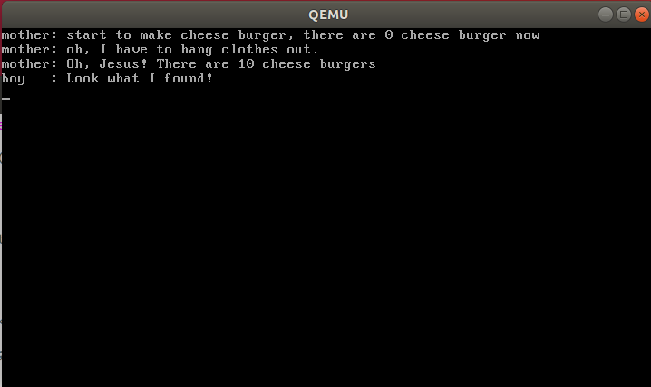
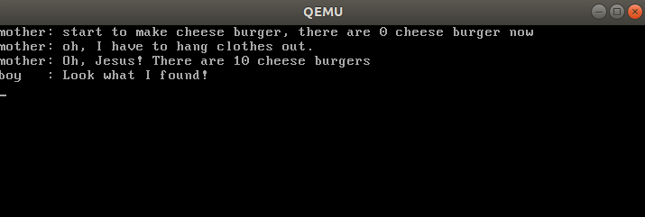
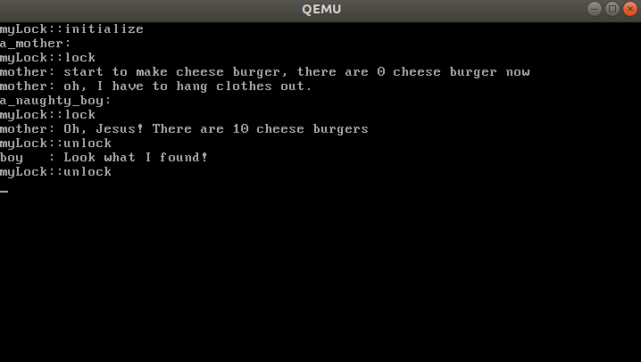
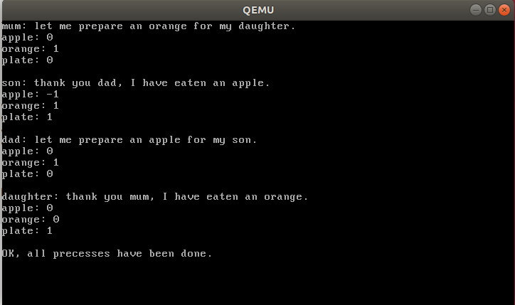
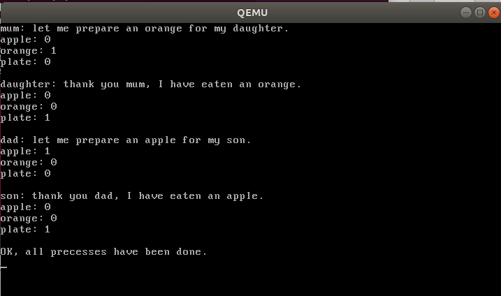
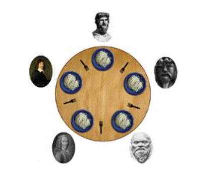
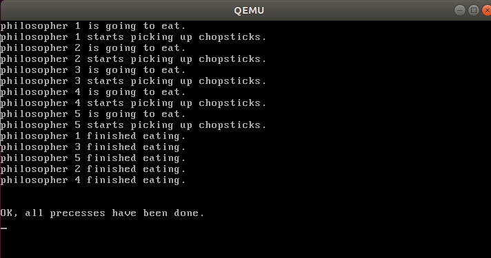
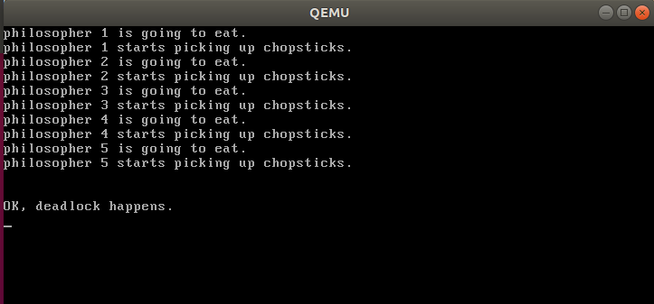
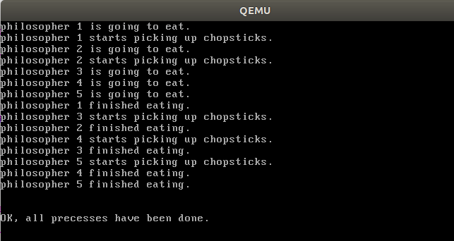

# 操作系统原理实验报告

| 实验名称   | 授课老师 | 学生姓名 | 学生学号     |
|:------:|:----:|:----:|:--------:|
| 并发与锁机制 | 张青   | 王健阳  | 21307261 |

## 实验要求

- 了解并尝试实现自旋锁

- 尝试复现并用信号量解决生产者-消费者问题

- 尝试复现并解决哲学家死锁问题

## 实验过程

### assignment 1 代码复现

#### A.1.1 代码复现

        在本章中，我们已经实现了自旋锁和信号量机制。现在，同学们需要复现教程中的自旋锁和信号量的实现方法，并用分别使用二者解决一个同步互斥问题，如消失的芝士汉堡问题。最后，将结果截图并说说你是怎么做的。

以下尝试分别使用自旋锁和信号量来解决消失的芝士汉堡问题：

> 自旋锁解决方法

###### 关键代码

（根据已经实现了的自旋锁类，分别在`a_mother`和`a_naughty_boy`线程执行的开始和结束处上锁和解锁，这样就实现了一个简单的线程互斥）

```cpp
SpinLock aLock;
int cheese_burger;

void a_mother(void *arg)
{
    aLock.lock();
    int delay = 0;

    printf("mother: start to make cheese burger, there are %d cheese burger now\n", cheese_burger);
    // make 10 cheese_burger
    cheese_burger += 10;

    printf("mother: oh, I have to hang clothes out.\n");
    // hanging clothes out
    delay = 0xfffffff;
    while (delay)
        --delay;
    // done

    printf("mother: Oh, Jesus! There are %d cheese burgers\n", cheese_burger);
    aLock.unlock();
}

void a_naughty_boy(void *arg)
{
    aLock.lock();
    printf("boy   : Look what I found!\n");
    // eat all cheese_burgers out secretly
    cheese_burger -= 10;
    // run away as fast as possible
    aLock.unlock();
}
```

###### 实验结果



可以看到成功实现了互斥访问，在母亲回来之前芝士汉堡并没有被孩子偷吃。

> 信号量解决方法

###### 关键代码

（根据已经实现了的信号量类来实现进程互斥，并将信号量初始化为1，因为互斥资源芝士汉堡数量只有一个，将lock和unlock操作依次转变成PV操作即可）

```cpp
void a_mother(void *arg)
{
    semaphore.P();
    int delay = 0;

    printf("mother: start to make cheese burger, there are %d cheese burger now\n", cheese_burger);
    // make 10 cheese_burger
    cheese_burger += 10;

    printf("mother: oh, I have to hang clothes out.\n");
    // hanging clothes out
    delay = 0xfffffff;
    while (delay)
        --delay;
    // done

    printf("mother: Oh, Jesus! There are %d cheese burgers\n", cheese_burger);
    semaphore.V();
}

void a_naughty_boy(void *arg)
{
    semaphore.P();
    printf("boy   : Look what I found!\n");
    // eat all cheese_burgers out secretly
    cheese_burger -= 10;
    // run away as fast as possible
    semaphore.V();
}
```

###### 实验结果



#### A.1.2 锁机制的实现

        我们使用了原子指令`xchg`来实现自旋锁。但是，这种方法并不是唯一的。例如，x86指令中提供了另外一个原子指令`bts`和`lock`前缀等，这些指令也可以用来实现锁机制。现在，同学们需要结合自己所学的知识，实现一个与本教程的实现方式不完全相同的锁机制。最后，测试你实现的锁机制，将结果截图并说说你是怎么做的。

这里实现了一个更加简略的自旋锁，利用变量`flag`来实现锁机制。

###### 关键代码

在`sync.h`中自定义`myLock`类

```cpp
class myLock
{
public:
    uint32 flag = 1;
public:
    myLock();
    void initialize();
    void lock();
    void unlock();
};
```

在`sync.cpp`里提供函数实现

```cpp
myLock::myLock(){
    initialize();
}
void myLock::lock(){
    printf("myLock::lock\n");
    while(!flag){
        //printf("%d", flag);
    }
    flag = 0;
}
void myLock::unlock(){
    printf("myLock::unlock\n");
    flag = 1;
}
void myLock::initialize(){
    printf("myLock::initialize\n");
    flag = 1;
}
```

###### 实验结果



（与A.1.1实现了一样的效果，孩子在母亲回来前没有偷吃汉堡）

### Assignment 2 生产者-消费者问题

#### A.2.1 Race Condition

        同学们可以任取一个生产者-消费者问题，然后在本教程的代码环境下创建多个线程来模拟这个问题。在2.1中，我们不会使用任何同步互斥的工具。因此，这些线程可能会产生冲突，进而无法产生我们预期的结果。此时，同学们需要将这个产生错误的场景呈现出来。最后，将结果截图并说说你是怎么做的。

###### 研究问题：多生产者-多消费者问题

问题简述：桌上只有一个盘子，每次只可以往里面放入一个水果。爸爸负责向盘子里放入苹果，妈妈负责向盘子里放入橘子。儿子只负责吃盘子里的苹果，女儿只负责吃盘子里的橘子。只有当盘子空的时候，爸爸或妈妈才可以往里面放入水果，只有当盘子非空的时候，儿子或女儿才可以从中拿水果。


###### 关键代码

（因为需要展示问题，初始化就绪队列时选择了一种依次执行会出错的顺序）

```cpp
Semaphore semapple;
Semaphore semorange;
Semaphore mutex;
Semaphore semplate;
int apple, orange, plate;

void dad(void *arg){
    printf("dad: let me prepare an apple for my son.\n");
    apple += 1; plate -= 1;
    printf("apple: %d\n", apple);
    printf("orange: %d\n", orange);
    printf("plate: %d\n\n", plate);
}
void mum(void *arg){
    printf("mum: let me prepare an orange for my daughter.\n");
    orange += 1; plate -= 1;
    printf("apple: %d\n", apple);
    printf("orange: %d\n", orange);
    printf("plate: %d\n\n", plate);
}
void son(void *arg){
    printf("son: thank you dad, I have eaten an apple.\n");
    apple -= 1; plate += 1;
    printf("apple: %d\n", apple);
    printf("orange: %d\n", orange);
    printf("plate: %d\n\n", plate);
}
void daughter(void *arg){
    printf("daughter: thank you mum, I have eaten an orange.\n");
    orange -= 1; plate += 1;
    printf("apple: %d\n", apple);
    printf("orange: %d\n", orange);
    printf("plate: %d\n\n", plate);
}


void first_thread(void *arg)
{
    // 第1个线程不可以返回
    stdio.moveCursor(0);
    for (int i = 0; i < 25 * 80; ++i)
    {
        stdio.print(' ');
    }
    stdio.moveCursor(0);
    apple = 0; semapple.initialize(0);
    orange = 0; semorange.initialize(0);
    plate = 1; semplate.initialize(1);
    mutex.initialize(1);
    //semaphore.initialize(1);

    programManager.executeThread(mum, nullptr, "second thread", 1);
    programManager.executeThread(son, nullptr, "third thread", 1);
    programManager.executeThread(dad, nullptr, "fourth thread", 1);
    programManager.executeThread(daughter, nullptr, "fifth thread", 1);

    int delay = 0xfffffff;
    while(-- delay){}
    printf("OK, all precesses have been done.\n");

    asm_halt();
}
```

###### 问题展示

        可以看到对资源的访问出现了错误，在未引入同步机制之前，son线程在apple变量为0时就先行访问了plate资源并拿走了水果。而这实际上是原属于女儿的橘子，由此便会引发一系列问题。



#### A.2.2 信号量解决方法

使用信号量解决上述你提出的生产者-消费者问题。最后，将结果截图并说说你是怎么做的。

以下借助PV操作对4个进程都进行了一些优化，实现了进程同步与互斥

> 说明

- `semapple`实现`dad`和`son`进程的同步访问

- `semorange`实现`mum`和`daughter`进程的同步访问

- `semplate`实现`plate`的互斥访问

###### 关键代码

```cpp
Semaphore semapple;
Semaphore semorange;
Semaphore mutex;
Semaphore semplate;
int apple, orange, plate;

void dad(void *arg){
    semplate.P(); //检查是否有可用的盘子，没有的话陷入阻塞。

    mutex.P(); //实现临界区互斥访问
    printf("dad: let me prepare an apple for my son.\n");
    semapple.V(); //往盘子里放入一个苹果
    apple += 1;
    plate -= 1;
    printf("apple: %d\n", apple);
    printf("orange: %d\n", orange);
    printf("plate: %d\n\n", plate);
    mutex.V(); //实现临界区互斥访问
}
void mum(void *arg){
    semplate.P(); //检查是否有可用的盘子，没有的话陷入阻塞。

    mutex.P(); //实现临界区互斥访问
    printf("mum: let me prepare an orange for my daughter.\n");
    semorange.V(); //往盘子里放入一个橘子
    orange += 1;
    plate -= 1;
    printf("apple: %d\n", apple);
    printf("orange: %d\n", orange);
    printf("plate: %d\n\n", plate);
    mutex.V(); //实现临界区互斥访问
}
void son(void *arg){
    //printf("semapple: %d\n", semapple.counter);
    semapple.P(); //检查盘子里是否有苹果，没有的话陷入阻塞。

    mutex.P(); //实现临界区互斥访问
    printf("son: thank you dad, I have eaten an apple.\n");
    apple -= 1;
    semplate.V(); //从盘子里拿出水果，所以多了一个空盘子
    plate += 1;
    printf("apple: %d\n", apple);
    printf("orange: %d\n", orange);
    printf("plate: %d\n\n", plate);
    mutex.V(); //实现临界区互斥访问
}
void daughter(void *arg){
    semorange.P(); //检查盘子里是否有橘子，没有的话陷入阻塞。

    mutex.P(); //实现临界区互斥访问
    printf("daughter: thank you mum, I have eaten an orange.\n");
    orange -= 1;
    semplate.V(); //从盘子里拿出水果，所以多了一个空盘子
    plate += 1;
    printf("apple: %d\n", apple);
    printf("orange: %d\n", orange);
    printf("plate: %d\n\n", plate);
    mutex.V(); //实现临界区互斥访问
}


void first_thread(void *arg)
{
    // 第1个线程不可以返回
    stdio.moveCursor(0);
    for (int i = 0; i < 25 * 80; ++i)
    {
        stdio.print(' ');
    }
    stdio.moveCursor(0);
    apple = 0; semapple.initialize(0);
    orange = 0; semorange.initialize(0);
    plate = 1; semplate.initialize(1);
    mutex.initialize(1);
    //semaphore.initialize(1);

    programManager.executeThread(mum, nullptr, "mum", 1);
    programManager.executeThread(son, nullptr, "son", 1);
    programManager.executeThread(dad, nullptr, "dad", 1);
    programManager.executeThread(daughter, nullptr, "daughter", 1);

    int delay = 0xfffffff;
    while(-- delay){}
    printf("OK, all precesses have been done.\n");

    asm_halt();
}
```

###### 实验结果



        可以看出程序运行符合预期。妈妈先往盘子里放入了一个橘子，后续依次到来的儿子父亲线程均被阻塞，直到女儿线程运行完后，儿子线程再次被阻塞，父亲运行完后儿子执行，最后完成整个程序。

### assignment 3 线程调度切换的秘密

        假设有 5 个哲学家，他们的生活只是思考和吃饭。这些哲学家共用一个圆桌，每位都有一把椅子。在桌子中央有一碗米饭，在桌子上放着 5 根筷子。当一位哲学家思考时，他与其他同事不交流。时而，他会感到饥饿，并试图拿起与他相近的两根筷子（筷子在他和他的左或右邻居之间）。一个哲学家一次只能拿起一根筷子。显然，他不能从其他哲学家手里拿走筷子。当一个饥饿的哲学家同时拥有两根筷子时，他就能吃。在吃完后，他会放下两根筷子，并开始思考。



#### A.3.1 初步解决方法

        同学们需要在本教程的代码环境下，创建多个线程来模拟哲学家就餐的场景。然后，同学们需要结合信号量来实现理论课教材中给出的关于哲学家就餐问题的方法。最后，将结果截图并说说你是怎么做的。

> 说明

- `chopsticks`筷子资源，用来实现用餐时的同步

- `mutex`互斥信号量，令哲学家拿筷子的这个动作彼此互斥，只有某个哲学家同时拿起两个筷子，进入就餐的时候才可以解除互斥

（以下暂未使用`mutex`信号量）

###### 关键代码

```cpp
Semaphore chopsticks[5];
int count = 0; //记录完成的进程数

void eating(){
    int delay = 0xfffffff;
    while(-- delay){}
}

void P1(void *arg){
    int i = 0;
    printf("philosopher 1 is going to eat.\n");
    //
    printf("philosopher 1 starts picking up chopsticks.\n");
    chopsticks[i].P();
    chopsticks[(i + 1) % 5].P();
    //
    eating();
    printf("philosopher 1 finished eating.\n");
    chopsticks[i].V();
    chopsticks[(i + 1) % 5].V();
    count ++;
}
void P2(void *arg){
    int i = 1;
    printf("philosopher 2 is going to eat.\n");
    //
    printf("philosopher 2 starts picking up chopsticks.\n");
    chopsticks[i].P();
    chopsticks[(i + 1) % 5].P();
    //
    eating();
    printf("philosopher 2 finished eating.\n");
    chopsticks[i].V();
    chopsticks[(i + 1) % 5].V();
    count ++;
}
void P3(void *arg){
    int i = 2;
    printf("philosopher 3 is going to eat.\n");
    //
    printf("philosopher 3 starts picking up chopsticks.\n");
    chopsticks[i].P();
    chopsticks[(i + 1) % 5].P();
    //
    eating();
    printf("philosopher 3 finished eating.\n");
    chopsticks[i].V();
    chopsticks[(i + 1) % 5].V();
    count ++;
}
void P4(void *arg){
    int i = 3;
    printf("philosopher 4 is going to eat.\n");
    //
    printf("philosopher 4 starts picking up chopsticks.\n");
    chopsticks[i].P();
    chopsticks[(i + 1) % 5].P();
    //
    eating();
    printf("philosopher 4 finished eating.\n");
    chopsticks[i].V();
    chopsticks[(i + 1) % 5].V();
    count ++;
}
void P5(void *arg){
    int i = 4;
    printf("philosopher 5 is going to eat.\n");
    //
    printf("philosopher 5 starts picking up chopsticks.\n");
    chopsticks[i].P();
    chopsticks[(i + 1) % 5].P();
    //
    eating();
    printf("philosopher 5 finished eating.\n");
    chopsticks[i].V();
    chopsticks[(i + 1) % 5].V();
    count ++;
}

void first_thread(void *arg)
{
    // 第1个线程不可以返回
    stdio.moveCursor(0);
    for (int i = 0; i < 25 * 80; ++i)
    {
        stdio.print(' ');
    }
    stdio.moveCursor(0);

    //初始化筷子信号量
    for(int i = 0; i < 5; i ++){chopsticks[i].initialize(1);}

    programManager.executeThread(P1, nullptr, "P1", 1);
    programManager.executeThread(P2, nullptr, "P2", 1);
    programManager.executeThread(P3, nullptr, "P3", 1);
    programManager.executeThread(P4, nullptr, "P4", 1);
    programManager.executeThread(P5, nullptr, "P5", 1);

    while(true){
        if(count == 5){
            printf("\n\nOK, all precesses have been done.\n");
            break;
        }
    }
    asm_halt();
}
```

###### 实验结果



成功解决了哲学家用餐问题。

#### A.3.2 死锁解决方法

        虽然3.1的解决方案保证两个邻居不能同时进食，但是它可能导致死锁。现在，同学们需要想办法将死锁的场景演示出来。然后，提出一种解决死锁的方法并实现之。最后，将结果截图并说说你是怎么做的。

> 死锁展示

        上述方法缺陷：依次拿起两支筷子不是原子操作，可以被分割。当时间片分配过小，以至于每个哲学家进程都在拿起第一支筷子的时候就被撤下处理机，这就会发生死锁。

        因此如果不改变时间片大小，那么增加每位哲学家拿筷子的间隔时间，就可以实现死锁。此处还引入了简陋的死锁监测机制：当程序运行时间达到十倍吃饭时间时，五个进程还没运行完毕，则初步判定发生了死锁，输出相应的判断语句。

###### 关键代码

```cpp
Semaphore chopsticks[5];
int count = 0;

void eating(){
    int delay = 0xfffffff;
    while(-- delay){}
}
void interval(){
    int delay = 0xfffffff;
    while(-- delay){}
}

void P1(void *arg){
    int i = 0;
    printf("philosopher 1 is going to eat.\n");
    //
    printf("philosopher 1 starts picking up chopsticks.\n");
    chopsticks[i].P();
    interval();
    chopsticks[(i + 1) % 5].P();
    //
    eating();
    printf("philosopher 1 finished eating.\n");
    chopsticks[i].V();
    chopsticks[(i + 1) % 5].V();
    count ++;
}
void P2(void *arg){
    int i = 1;
    printf("philosopher 2 is going to eat.\n");
    //mutex.P();
    printf("philosopher 2 starts picking up chopsticks.\n");
    chopsticks[i].P();
    interval();
    chopsticks[(i + 1) % 5].P();
    //mutex.V();
    eating();
    printf("philosopher 2 finished eating.\n");
    chopsticks[i].V();
    chopsticks[(i + 1) % 5].V();
    count ++;
}
void P3(void *arg){
    int i = 2;
    printf("philosopher 3 is going to eat.\n");
    //
    printf("philosopher 3 starts picking up chopsticks.\n");
    chopsticks[i].P();
    interval();
    chopsticks[(i + 1) % 5].P();
    //
    eating();
    printf("philosopher 3 finished eating.\n");
    chopsticks[i].V();
    chopsticks[(i + 1) % 5].V();
    count ++;
}
void P4(void *arg){
    int i = 3;
    printf("philosopher 4 is going to eat.\n");
    //
    printf("philosopher 4 starts picking up chopsticks.\n");
    chopsticks[i].P();
    interval();
    chopsticks[(i + 1) % 5].P();
    //
    eating();
    printf("philosopher 4 finished eating.\n");
    chopsticks[i].V();
    chopsticks[(i + 1) % 5].V();
    count ++;
}
void P5(void *arg){
    int i = 4;
    printf("philosopher 5 is going to eat.\n");
    //
    printf("philosopher 5 starts picking up chopsticks.\n");
    chopsticks[i].P();
    interval();
    chopsticks[(i + 1) % 5].P();
    //
    eating();
    printf("philosopher 5 finished eating.\n");
    chopsticks[i].V();
    chopsticks[(i + 1) % 5].V();
    count ++;
}

void first_thread(void *arg)
{
    // 第1个线程不可以返回
    stdio.moveCursor(0);
    for (int i = 0; i < 25 * 80; ++i)
    {
        stdio.print(' ');
    }
    stdio.moveCursor(0);

    //
    for(int i = 0; i < 5; i ++){chopsticks[i].initialize(1);}

    programManager.executeThread(P1, nullptr, "P1", 1);
    programManager.executeThread(P2, nullptr, "P2", 1);
    programManager.executeThread(P3, nullptr, "P3", 1);
    programManager.executeThread(P4, nullptr, "P4", 1);
    programManager.executeThread(P5, nullptr, "P5", 1);
    int delay = 0, ddelay = 0;
    while(true){
        if(count == 5){
            printf("\n\nOK, all precesses have been done.\n");
            break;
        }
        delay ++;
        if(delay == 0xfffffff){
            delay = 0;
            ddelay ++;
        }
        if(ddelay == 10){
            printf("\n\nOK, deadlock happens.\n");
            break;
        }
    }
    asm_halt();
}
```

###### 实验结果



可以看到确实发生了死锁。

> 解决方法

        借助`mutex`这个互斥信号量来解决哲学家问题。令拿筷子互斥之后，桌上每时每刻都至多只有一个哲学家在持有部分筷子资源并等待。其他哲学家此时要么在思考（没获得任何资源），要么在吃饭（已获得全部资源）。而等待的原因也是因为该筷子已经被某位哲学家用去吃饭了，而不是拿着干等其他资源的状态。故等待时间始终有限，不会超过这位哲学家的吃饭时间。故不会发生死锁。

###### 关键代码

```cpp
Semaphore chopsticks[5];
Semaphore mutex;
int count = 0; //记录有几个哲学家完成了就餐

//哲学家就餐函数
void eating(){
    int delay = 0xfffffff;
    while(-- delay){}
}
void interval(){
    int delay = 0xfffffff;
    while(-- delay){}
}

void P1(void *arg){
    int i = 0;
    printf("philosopher 1 is going to eat.\n");
    mutex.P();
    printf("philosopher 1 starts picking up chopsticks.\n");
    chopsticks[i].P();
    interval();
    chopsticks[(i + 1) % 5].P();
    mutex.V();
    eating();
    printf("philosopher 1 finished eating.\n");
    chopsticks[i].V();
    chopsticks[(i + 1) % 5].V();
    count ++;
}
void P2(void *arg){
    int i = 1;
    printf("philosopher 2 is going to eat.\n");
    mutex.P();
    printf("philosopher 2 starts picking up chopsticks.\n");
    chopsticks[i].P();
    interval();
    chopsticks[(i + 1) % 5].P();
    mutex.V();
    eating();
    printf("philosopher 2 finished eating.\n");
    chopsticks[i].V();
    chopsticks[(i + 1) % 5].V();
    count ++;
}
void P3(void *arg){
    int i = 2;
    printf("philosopher 3 is going to eat.\n");
    mutex.P();
    printf("philosopher 3 starts picking up chopsticks.\n");
    chopsticks[i].P();
    interval();
    chopsticks[(i + 1) % 5].P();
    mutex.V();
    eating();
    printf("philosopher 3 finished eating.\n");
    chopsticks[i].V();
    chopsticks[(i + 1) % 5].V();
    count ++;
}
void P4(void *arg){
    int i = 3;
    printf("philosopher 4 is going to eat.\n");
    mutex.P();
    printf("philosopher 4 starts picking up chopsticks.\n");
    chopsticks[i].P();
    interval();
    chopsticks[(i + 1) % 5].P();
    mutex.V();
    eating();
    printf("philosopher 4 finished eating.\n");
    chopsticks[i].V();
    chopsticks[(i + 1) % 5].V();
    count ++;
}
void P5(void *arg){
    int i = 4;
    printf("philosopher 5 is going to eat.\n");
    mutex.P();
    printf("philosopher 5 starts picking up chopsticks.\n");
    chopsticks[i].P();
    interval();
    chopsticks[(i + 1) % 5].P();
    mutex.V();
    eating();
    printf("philosopher 5 finished eating.\n");
    chopsticks[i].V();
    chopsticks[(i + 1) % 5].V();
    count ++;
}

void first_thread(void *arg)
{
    // 第1个线程不可以返回
    stdio.moveCursor(0);
    for (int i = 0; i < 25 * 80; ++i)
    {
        stdio.print(' ');
    }
    stdio.moveCursor(0);

    mutex.initialize(1);
    for(int i = 0; i < 5; i ++){chopsticks[i].initialize(1);}

    programManager.executeThread(P1, nullptr, "P1", 1);
    programManager.executeThread(P2, nullptr, "P2", 1);
    programManager.executeThread(P3, nullptr, "P3", 1);
    programManager.executeThread(P4, nullptr, "P4", 1);
    programManager.executeThread(P5, nullptr, "P5", 1);
    //当所有哲学家完成就餐的时候，输出结束语句。
    while(true){
        if(count == 5){
            printf("\n\nOK, all precesses have been done.\n");
            break;
        }
    }
    asm_halt();
}
```

###### 实验结果



分析如下：

1. P1打算去吃饭。

2. P1开始拿起筷子，期间阻止其他哲学家访问筷子。

3. P1此时还在就餐，P2打算去吃饭。

4. P1此时还在就餐，P2开始拿起筷子，但发现一只筷子被占用，于是被阻塞。

5. P1此时还在就餐，P3打算去吃饭，但P2还在拿起筷子阶段（被阻塞），故P3无法拿筷子

6. P4同理

7. P5同理

8. P1完成就餐，释放了筷子资源，P2得以进入就餐，同时P3得以进入拿筷子阶段

9. P2此时还在就餐，P3开始拿起筷子，但发现一只筷子被占用，于是被阻塞（此时P3仍在拿着筷子，故4,5依旧被阻塞，无法进入拿筷子状态）

10. P2完成就餐，释放了筷子资源，P3得以进入就餐，同时P4进入了拿筷子阶段

11. P3此时还在就餐，P4开始拿起筷子，但发现一只筷子被占用，于是被阻塞（同理，此时P5还在原地，无法进入拿筷子阶段）

12. P3完成就餐，释放了筷子资源，P4得以进入就餐，同时P5进入了拿筷子阶段

13. ......

## 总结

        这次实验，让我了解到了自旋锁以及信号量的实现机制，并亲自做出了实现以及初步应用。借助这次实验，我也接触到并尝试解决了一些经典的互斥与同步问题。例如多生产者-多消费者问题，吸烟者问题，读者写者问题等。然后在实验中将多生产者-多消费者问题以及哲学家问题整体呈现了出来，并尝试着分析了全过程。做完整个实验，使得我对进程互斥与同步有了更深的理解。
