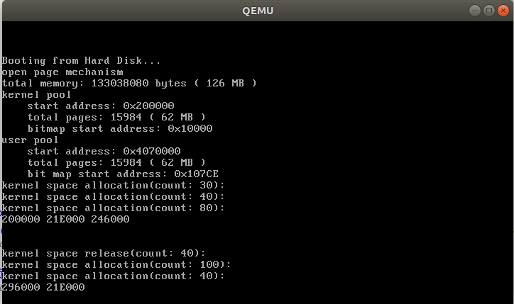
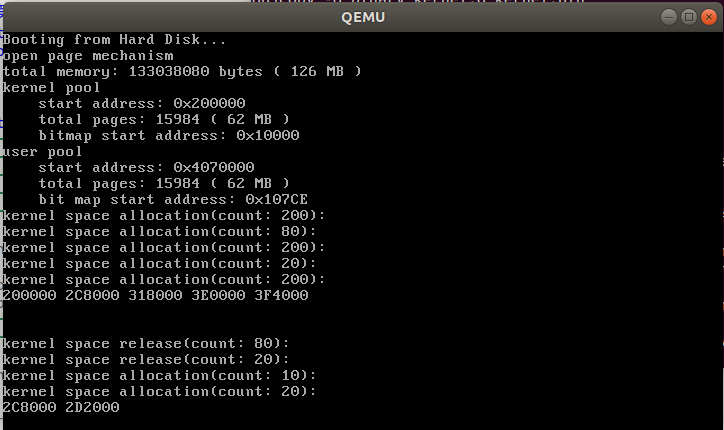
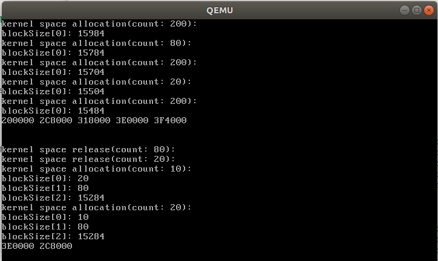
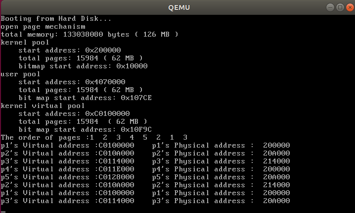
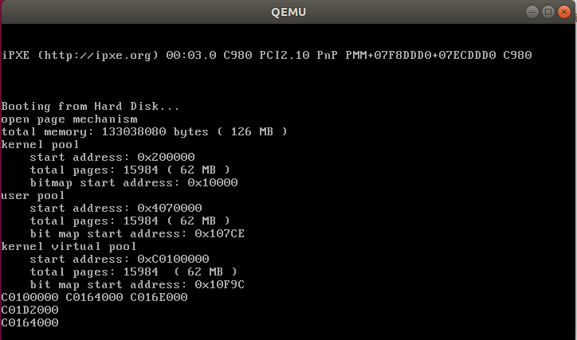
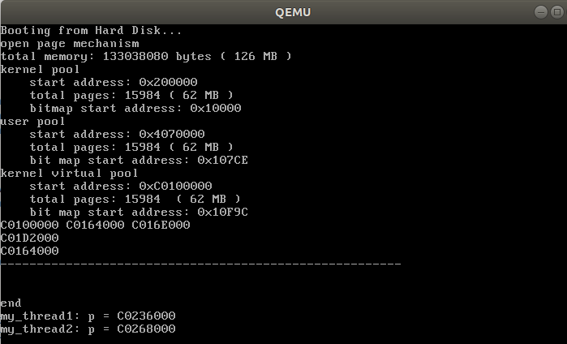

# 操作系统原理实验报告

| 实验名称 | 授课老师 | 学生姓名 | 学生学号     |
|:----:|:----:|:----:|:--------:|
| 内存管理 | 张青   | 王健阳  | 21307261 |

## 实验要求

- 了解内存的分页机制

- 了解基本的动态分页算法

- 了解基本的页面置换算法

- 了解虚拟内存机制

## 实验过程

> 数据结构引入

位图（bitmap）

```cpp
class BitMap
{
public:
    // 被管理的资源个数，bitmap的总位数
    int length;
    // bitmap的起始地址
    char *bitmap;
public:
    // 初始化
    BitMap();
    // 设置BitMap，bitmap=起始地址，length=总位数(被管理的资源个数)
    void initialize(char *bitmap, const int length);
    // 获取第index个资源的状态，true=allocated，false=free
    bool get(const int index) const;
    // 设置第index个资源的状态，true=allocated，false=free
    void set(const int index, const bool status);
    // 分配count个连续的资源，若没有则返回-1，否则返回分配的第1个资源单元序号
    int allocate(const int count);
    // 释放第index个资源开始的count个资源
    void release(const int index, const int count);
    // 返回Bitmap存储区域
    char *getBitmap();
    // 返回Bitmap的大小
    int size() const;
private:
    // 禁止Bitmap之间的赋值
    BitMap(const BitMap &) {}
    void operator=(const BitMap&) {}
};
```

地址池（AddressPool）

```cpp
class AddressPool
{
public:
    BitMap resources;
    int startAddress;
public:
    AddressPool();
    // 初始化地址池
    void initialize(char *bitmap, const int length,const int startAddress);
    // 从地址池中分配count个连续页，成功则返回第一个页的地址，失败则返回-1
    int allocate(const int count);
    // 释放若干页的空间
    void release(const int address, const int amount);
};
```

内存管理器（MemoryManager）

```cpp
//此处未引入虚拟内存机制
class MemoryManager
{
public:
    // 可管理的内存容量
    int totalMemory;
    // 内核物理地址池
    AddressPool kernelPhysical;
    // 用户物理地址池
    AddressPool userPhysical;

public:
    MemoryManager();

    // 初始化地址池
    void initialize();

    // 从type类型的物理地址池中分配count个连续的页
    // 成功，返回起始地址；失败，返回0
    int allocatePhysicalPages(enum AddressPoolType type, const int count);

    // 释放从paddr开始的count个物理页
    void releasePhysicalPages(enum AddressPoolType type, const int startAddress, const int count);

    // 获取内存总容量
    int getTotalMemory();

    // 开启分页机制
    void openPageMechanism();

};
```

### Assignment 1   实现二级分页机制

        复现参考代码，实现二级分页机制，并能够在虚拟机地址空间中进行内存管理，包括内存的申请和释放等，截图并给出过程解释。

#### 关键代码

根据要求，在`first_thread`里添加代码如下：

```cpp
void first_thread(void *arg)
{
    // 第1个线程不可以返回
    //stdio.moveCursor(0);
    //for (int i = 0; i < 25 * 80; ++i)
    //{
        //stdio.print(' ');
    //}
    //stdio.moveCursor(0);

    //内存池初始化为空，现申请三次内存页，依次是30,40,80页
    char *p1 = (char *)memoryManager.allocatePhysicalPages(AddressPoolType::KERNEL, 30);
    char *p2 = (char *)memoryManager.allocatePhysicalPages(AddressPoolType::KERNEL, 40);
    char *p3 = (char *)memoryManager.allocatePhysicalPages(AddressPoolType::KERNEL, 80);
    //输出每次分配后的起始地址
    printf("%x %x %x\n\n\n", p1, p2, p3);
    //释放掉p2的40个页，再次申请两次内存资源，一次100页，一次40页
    memoryManager.releasePhysicalPages(AddressPoolType::KERNEL, (int)p2, 40);
    char *p4 = (char *)memoryManager.allocatePhysicalPages(AddressPoolType::KERNEL, 100);
    char *p5 = (char *)memoryManager.allocatePhysicalPages(AddressPoolType::KERNEL, 40);
    //再次输出分配后的起始地址
    printf("%x %x\n", p4, p5);

    asm_halt();
}
```

#### 实验结果



        可以看到，内核空间地址池的初始地址为`0x200000`。首次分配按照连续分配，第一次申请过后，三个分区的起始地址分别为`0x200000`，`0x21E000`，`0x246000`。说明如下：

$\qquad 30\times4096=(30)_{10}\times16^3=(1E000)_{16} \qquad (20000)_{16}+(1E000)_{16}=(21E000)_{16}$

$\qquad 40 \times 4096=(40)_{10}\times 16^3=(28000)_{16} \qquad (21E000)_{16}+(28000)_{16}=(246000)_{16}$

$\qquad 80 \times 4096=(80)_{10} \times 16^3=(50000)_{16} \qquad (246000)_{16} + (500000)_{16}=(296000)_{16}$

        随后释放了p2分区，再次申请了p4和p5两个新分区。先前释放p2产生了内存碎片，但由于太小，故p4只可以放在p3后面，地址也如上所示。但后续的p5则刚好可以放进p2的碎片中，故从输出中可以看到，p5跟原先p2分区的起始地址一致。

### Assignment 2   实现动态分区算法

        参照理论课上的学习的物理内存分配算法如first-fit, best-fit等实现动态分区算法等，或者自行提出自己的算法。

> 统一测试用例：

```cpp
void first_thread(void *arg)
{
    // 第1个线程不可以返回
    //stdio.moveCursor(0);
    //for (int i = 0; i < 25 * 80; ++i)
    //{
        //stdio.print(' ');
    //}
    //stdio.moveCursor(0);
    char *p1 = (char *)memoryManager.allocatePhysicalPages(AddressPoolType::KERNEL, 200);
    char *p2 = (char *)memoryManager.allocatePhysicalPages(AddressPoolType::KERNEL, 80);
    char *p3 = (char *)memoryManager.allocatePhysicalPages(AddressPoolType::KERNEL, 200);
    char *p4 = (char *)memoryManager.allocatePhysicalPages(AddressPoolType::KERNEL, 20);
    char *p5 = (char *)memoryManager.allocatePhysicalPages(AddressPoolType::KERNEL, 200);

    printf("%x %x %x %x %x\n\n\n", p1, p2, p3, p4, p5);

    memoryManager.releasePhysicalPages(AddressPoolType::KERNEL, (int)p2, 80);
    memoryManager.releasePhysicalPages(AddressPoolType::KERNEL, (int)p4, 20);
    char *p6 = (char *)memoryManager.allocatePhysicalPages(AddressPoolType::KERNEL, 10);
    char *p7 = (char *)memoryManager.allocatePhysicalPages(AddressPoolType::KERNEL, 20);

    printf("%x %x\n", p6, p7);

    asm_halt();
}
```

- 初始化五个分区，大小依次是：200，80，200，20，200

- 释放80和20的分区

- 再次申请两个10和20的分区

> first-fit

#### 关键代码

实验中提供的代码已经实现了`fitstFit`算法，故此处便直接沿用，复现了这一过程

```cpp
int BitMap::firstFit(const int count){
    if (count == 0)
        return -1;

    int index, empty, start;

    index = 0;
    while (index < length)
    {
        // 越过已经分配的资源
        while (index < length && get(index))
            ++index;

        // 不存在连续的count个资源
        if (index == length)
            return -1;

        // 找到1个未分配的资源
        // 检查是否存在从index开始的连续count个资源
        empty = 0;
        start = index;

    while ((index < length) && (!get(index)) && (empty < count))
    {
        ++empty;
        ++index;
    }

    // 存在连续的count个资源
    if (empty == count)
    {
        for (int i = 0; i < count; ++i)
        {
            set(start + i, true);
        }

        return start;
    }

    }
    return -1;   
}
```

#### 实验结果



可以看出，10分区占据了原先的80分区，20分区紧随其后，符合first-fit算法特性

> best-fit

#### 关键代码

```cpp
int BitMap::bestFit(const int count){
    //printf("bestFit\n");
    if (count == 0)
        return -1;

    int index, empty, start, space = 0;
    //设立空闲分区表，记录空闲分区大小以及起始地址
    int blockSize[256] = {0};
    int blockStart[256] = {0};


    index = 0;
    while (index < length)
    {
        // 越过已经分配的资源
        while (index < length && get(index))
            ++index;

        // 不存在连续的count个资源
        if (index == length)
            return -1;

        // 找到1个未分配的资源
        // 检查是否存在从index开始的连续count个资源
        empty = 0;
        start = index;

    while((index < length) && (!get(index))){empty ++; index ++;}
    blockSize[space] = empty;
    blockStart[space] = start;
    space ++;
    }

    //按照分区大小进行排序
    for(int i = 0; i < space; i ++)
        for(int j = 0; j < space - 1; j ++){
            if(blockSize[j] > blockSize[j + 1]){
                int t1 = blockSize[j]; int t2 = blockStart[j];
                blockSize[j] = blockSize[j + 1]; blockStart[j] = blockStart[j + 1];
                blockSize[j + 1] = t1; blockStart[j + 1] = t2;
            }
        }
    for(int i = 0; i < space; i ++)
        printf("blockSize[%d]: %d\n", i, blockSize[i]);

    //从小到大依次检索，检测到第一个符合的分区就进行分配
    for(int i = 0; i < space; i ++){
        if(blockSize[i] >= count){
            start = blockStart[i];
            for(int k = 0; k < count; k ++)
                set(start + k, true);
            return start;
        }
    }
    return -1;   
}
```

#### 实验结果



        可以看出，10分区占据了原先大小为20的分区，是“最优选择”，然后大小为20的分区才占据了原先大小为80的大分区，符合best-fit算法的特性

### Assignment 3   实现页面置换算法

        参照理论课上虚拟内存管理的页面置换算法如FIFO、LRU等，实现页面置换，也可以提出自己的算法。

> 测试用例：

```cpp
void FIFO_thread(void *arg){
    int p[8] = {1, 2, 3, 4, 5, 2, 1, 3};
    printf("The order of pages :");    
    for(int i = 0; i < 8; i ++){
        printf("%d  ",p[i]);
    }
    printf("\n");
    for (int i = 0; i < 8; i ++){    
        char *temp = (char *)memoryManager.allocatePagesFIFO(AddressPoolType::KERNEL, 10, p[i]);
        printf("p%d's Virtual address :%x    ",p[i], temp);
        printf("p%d's Physical address :  %x \n",p[i],memoryManager.vaddr2paddr((int)temp));
    }
    asm_halt();
}
```

#### 关键代码

此处实现的是FIFO页面置换算法

```cpp
int MemoryManager::allocatePagesFIFO(enum AddressPoolType type, const int count,int name){
    int temp = 0;    //用于判断该名称的区是否存在已有的进程分区中
    int virtualAddress = 0;    //虚拟地址
    for(int i = 0; i < this->vpsize; i ++){
        if(this->vpname[i] == name){
            temp = 1;
            virtualAddress = this->vpaddr[i];    
            break;
        }
    }
    // 若仍未分配虚拟地址，进行分别并记录
    if(temp == 0){
        this->vpsize ++;    //分区数目增加
        virtualAddress = allocateVirtualPages(type, count);    
        this->vpaddr[vpsize - 1] =  virtualAddress;    
        this->vpname[vpsize - 1] = name;    
    }
    //虚拟地址分配失败，终止
    if (!virtualAddress){
        return 0;
    }
    bool flag;
    int physicalPageAddress;
    int vaddress = virtualAddress;
    int tt = 0;    //判断将访问的分区是否在驻留集中
    for(int i = 0; i < 3; i ++){
        if(this->FIFO[i] == vaddress){
            tt = 1;     
            break;
        }
    }    
    //如果在驻留集中，则直接跳转到末尾，直接返回虚拟地址即可
    //如果不在驻留集中，则需要按照FIFO算法进行调度，分配相应的物理地址
    if(tt == 0){        
        //先保证驻留集中存在该虚拟地址，再重新分配物理地址
        if(vpsize < 4){    //前3次驻留集未空，直接将生产物理地址载入
            this->FIFO[vpsize - 1] = vaddress;
        }
        else{
            //替换最早进入驻留集的分区(页)
            int vaddr = FIFO[0];    
            int *pte;
            for (int i = 0; i < count; ++ i, vaddr += PAGE_SIZE){    
                releasePhysicalPages(AddressPoolType::KERNEL, vaddr2paddr(vaddr), 1);
                //虚拟地址不释放，后续可能还会使用到，且虚拟地址充足
                pte = (int *)toPTE(vaddr);    
                *pte = 0;
            }
            //进行一个队列的更新
            this->FIFO[0] = this->FIFO[1];    
            this->FIFO[1] = this->FIFO[2];
            this->FIFO[2] = vaddress;        
        } 
        //为新的分区分配物理页
        for (int i = 0; i < count; ++ i, vaddress += PAGE_SIZE){
            flag = false;
            // 第二步：从物理地址池中分配一个物理页
            physicalPageAddress = allocatePhysicalPages(type, 1);
            if (physicalPageAddress){
                // 第三步：为虚拟页建立页目录项和页表项，使虚拟页内的地址经过分页机制变换到物理页内。
                flag = connectPhysicalVirtualPage(vaddress, physicalPageAddress);
            }else{
                flag = false;
            }
            // 分配失败，释放前面已经分配的虚拟页和物理页表
            if (!flag){
                releasePages(type, virtualAddress, i);        
                releaseVirtualPages(type, virtualAddress + i * PAGE_SIZE, count - i);
                return 0;
            }
        }
    }
    return virtualAddress;
}
```

#### 实验结果

根据测试用例的分析结果如下：

1 -> 2 -> 3 -> 4 -> 5 -> 2 -> 1 -> 3

| 1   | 1   | 1   | 4   | 4   | 4   | 1   | 1   |
| --- | --- | --- | --- | --- | --- | --- | --- |
|     | 2   | 2   | 2   | 5   | 5   | 5   | 3   |
|     |     | 3   | 3   | 3   | 2   | 2   | 2   |



p1~p5：

虚拟地址：`C0100000 ~ C0128000`连续分布

物理地址：`200000 ~ 214000`共三个页面

可以看到，FIFO算法之下，每个分区的物理地址呈固定循环分布，与其他因素均无关。

### Assignment 4   实现虚拟页内存管理

复现“虚拟页内存管理”一节的代码，完成如下要求:

- 结合代码分析虚拟页内存分配的三步过程和虚拟页内存释放。

- 构造测试例子来分析虚拟页内存管理的实现是否存在bug。如果存在，则尝试修复并再次测试。否则，结合测例简要分析虚拟页内存管理的实现的正确性。

- （**不做要求，对评分没有影响**）如果你有想法，可以在自己的理解的基础上，参考ucore，《操作系统真象还原》，《一个操作系统的实现》等资料来实现自己的虚拟页内存管理。在完成之后，你需要指明相比较于本教程，你的实现的虚拟页内存管理的特点所在。

#### 代码分析

> 测试用例构造

```cpp
void first_thread(void *arg)
{
    // 第1个线程不可以返回
    // stdio.moveCursor(0);
    // for (int i = 0; i < 25 * 80; ++i)
    // {
    //     stdio.print(' ');
    // }
    // stdio.moveCursor(0);

    char *p1 = (char *)memoryManager.allocatePages(AddressPoolType::KERNEL, 100);
    char *p2 = (char *)memoryManager.allocatePages(AddressPoolType::KERNEL, 10);
    char *p3 = (char *)memoryManager.allocatePages(AddressPoolType::KERNEL, 100);

    printf("%x %x %x\n", p1, p2, p3);

    memoryManager.releasePages(AddressPoolType::KERNEL, (int)p2, 10);
    p2 = (char *)memoryManager.allocatePages(AddressPoolType::KERNEL, 100);

    printf("%x\n", p2);

    p2 = (char *)memoryManager.allocatePages(AddressPoolType::KERNEL, 10);

    printf("%x\n", p2);

    asm_halt();
}
```

虚拟页内存分配三步如下：

- **从虚拟地址池中分配若干连续的虚拟页**。

- **对每一个虚拟页，从物理地址池中分配1页**。

- **为虚拟页建立页目录项和页表项，使虚拟页内的地址经过分页机制变换到物理页内**。

```cpp
int MemoryManager::allocatePages(enum AddressPoolType type, const int count){
    // 第一步：从虚拟地址池中分配若干虚拟页
    int virtualAddress = allocateVirtualPages(type, count);
    if (!virtualAddress){
        return 0;
    }

    bool flag;
    int physicalPageAddress;
    int vaddress = virtualAddress;

    // 依次为每一个虚拟页指定物理页
    for (int i = 0; i < count; ++i, vaddress += PAGE_SIZE){
        flag = false;
        // 第二步：从物理地址池中分配一个物理页
        physicalPageAddress = allocatePhysicalPages(type, 1);
        if (physicalPageAddress){
            //printf("allocate physical page 0x%x\n", physicalPageAddress);
            // 第三步：为虚拟页建立页目录项和页表项，使虚拟页内的地址经过分页机制变换到物理页内。
            flag = connectPhysicalVirtualPage(vaddress, physicalPageAddress);
        }
        else{
            flag = false;
        }

        // 分配失败，释放前面已经分配的虚拟页和物理页表
        if (!flag){
            // 前i个页表已经指定了物理页
            releasePages(type, virtualAddress, i);
            // 剩余的页表未指定物理页
            releaseVirtualPages(type, virtualAddress + i * PAGE_SIZE, count - i);
            return 0;
        }
    }
    return virtualAddress;
}
```

> 1.从虚拟地址池中分配若干连续的虚拟页

在`MemoryManager`的内核虚拟内存池中申请一块`count`大小的内存分区，实现虚拟页分配

```cpp
int MemoryManager::allocateVirtualPages(enum AddressPoolType type, const int count){
    int start = -1;
    if (type == AddressPoolType::KERNEL){
        start = kernelVirtual.allocate(count);
    }
    return (start == -1) ? 0 : start;
}
```

> 2.对每一个虚拟页，从物理地址池中分配1页

调用`allocatePhysicalPages`函数实现这一过程，并记录下返回的物理地址。

```cpp
physicalPageAddress = allocatePhysicalPages(type, 1); 
//
int MemoryManager::allocatePhysicalPages(enum AddressPoolType type, const int count){ 
    int start = -1; 
    if (type == AddressPoolType::KERNEL){ 
        start = kernelPhysical.allocate(count); 
    } 
    else if (type == AddressPoolType::USER){ 
        start = userPhysical.allocate(count); 
    } 
    return (start == -1) ? 0 : start; 
}
```

> 3.为虚拟页建立页目录项和页表项，使虚拟页内的地址经过分页机制变换到物理页内

        调用`connectPhysicalVirtualPage`函数实现物理地址与虚拟地址的一一绑定，而这一绑定可以通过修改该虚拟页对应的页表项来实现。以下代码通过虚拟地址，求得了对应的页目录项以及页表项，程序便可以据此寻到并修改页表项，实现地址的绑定

```cpp
flag = connectPhysicalVirtualPage(vaddress, physicalPageAddress);

bool MemoryManager::connectPhysicalVirtualPage(const int virtualAddress, const int physicalPageAddress){
    // 计算虚拟地址对应的页目录项和页表项
    int *pde = (int *)toPDE(virtualAddress);
    int *pte = (int *)toPTE(virtualAddress);

    // 页目录项无对应的页表，先分配一个页表
    if(!(*pde & 0x00000001)){
        // 从内核物理地址空间中分配一个页表
        int page = allocatePhysicalPages(AddressPoolType::KERNEL, 1);
        if (!page)
            return false;

        // 使页目录项指向页表
        *pde = page | 0x7;
        // 初始化页表
        char *pagePtr = (char *)(((int)pte) & 0xfffff000);
        memset(pagePtr, 0, PAGE_SIZE);
    }
    // 使页表项指向物理页
    *pte = physicalPageAddress | 0x7;
    return true;
}
```

虚拟内存释放如下：

        因虚拟页均为连续分配，故释放时只需指定释放的起始地址以及分区大小。通过求解页目录项以及页表项的方式求得每个虚拟页对应的物理页地址，调用`releasePhysicalPages`函数将该物理页释放，并清空对应的页表项，最后再释放虚拟页本身。

```cpp
void MemoryManager::releasePages(enum AddressPoolType type, const int virtualAddress, const int count)
{
    int vaddr = virtualAddress;
    int *pte;
    for (int i = 0; i < count; ++i, vaddr += PAGE_SIZE)
    {
        // 第一步，对每一个虚拟页，释放为其分配的物理页
        releasePhysicalPages(type, vaddr2paddr(vaddr), 1);

        // 设置页表项为不存在，防止释放后被再次使用
        pte = (int *)toPTE(vaddr);
        *pte = 0;
    }

    // 第二步，释放虚拟页
    releaseVirtualPages(type, virtualAddress, count);
}

int MemoryManager::vaddr2paddr(int vaddr)
{
    int *pte = (int *)toPTE(vaddr);
    int page = (*pte) & 0xfffff000;
    int offset = vaddr & 0xfff;
    return (page + offset);
}
```

> `5/src`的代码运行结果如下：



        可以看到，进程先后申请了三个分区，大小依次为100,10,100。随后进程释放了p3，又再次以p2的名字申请了两个分区，大小为100和10.

        由于p1和p3之间只夹有10个页的空隙，故新申请的100页分区只好位于p3末尾处。但后来的分区则刚好可以填进先前由于释放p2而造成的空白中，故后者的地址同最开始的p2，都是`C0164000`。

#### 问题呈现

        联系到先前的进程同步与互斥，容易想到当两个进程同时申请同一块内存空间时会出现竞争条件。但复现此处略显困难，困难之处主要在于：难以保证进程之间的“同时申请”，以及“同时申请”发生的时候，刚好申请的是同一片内存空间。于是此处只展现解决之后的代码，锁的实现借助了上次实验的现成代码。

        因为此前所有的分区申请都只是基于`first_thread`这一个进程，所以不会有什么问题。但当多进程同时进行内存分区申请的时候，就有可能发生冲突。并且在实现代码中似乎并无维持互斥访问的功能。故此处以两个进程申请分区为例，进行了上锁互斥访问的处理，算是解决方法之一。

```cpp
SpinLock lock;
void my_thread1(void *arg){
    lock.lock();
    char *p = (char *)memoryManager.allocatePages(AddressPoolType::KERNEL, 50);
    printf("my_thread1: p = %x\n", p);
    lock.unlock();
}
void my_thread2(void *arg){
    lock.lock();
    char *p = (char *)memoryManager.allocatePages(AddressPoolType::KERNEL, 50);
    printf("my_thread2: p = %x\n", p);
    lock.unlock();
}


void first_thread(void *arg)
{
    // 第1个线程不可以返回
    // stdio.moveCursor(0);
    // for (int i = 0; i < 25 * 80; ++i)
    // {
    //     stdio.print(' ');
    // }
    // stdio.moveCursor(0);

    char *p1 = (char *)memoryManager.allocatePages(AddressPoolType::KERNEL, 100);
    char *p2 = (char *)memoryManager.allocatePages(AddressPoolType::KERNEL, 10);
    char *p3 = (char *)memoryManager.allocatePages(AddressPoolType::KERNEL, 100);

    printf("%x %x %x\n", p1, p2, p3);

    memoryManager.releasePages(AddressPoolType::KERNEL, (int)p2, 10);
    p2 = (char *)memoryManager.allocatePages(AddressPoolType::KERNEL, 100);

    printf("%x\n", p2);

    p2 = (char *)memoryManager.allocatePages(AddressPoolType::KERNEL, 10);

    printf("%x\n", p2);
    printf("-------------------------------------------------------\n");
    int pid1 = programManager.executeThread(my_thread1, nullptr, "my first thread", 1);
    int pid2 = programManager.executeThread(my_thread2, nullptr, "my second thread", 1);
    printf("\n\nend\n");
    asm_halt();
}
```

结果如下：



可以看出，两个进程都正常申请到了自己对应的分区。

----------------

## 总结

        此次实验，让我对计算机内部的分页机制有了深入了解。借此机会，也再次复习了各种不同的动态分区以及页面置换算法。这次实验，让我深刻感受到了理论与实践的差距。理论课上觉得很自然的算法，到了真正需要实现的时候，哪怕是FIFO也不能算是简单。因为其中还有很多的细节需要去处理。同时，这也是我第一次尝试用代码实现分页机制，也算是收获颇丰。
